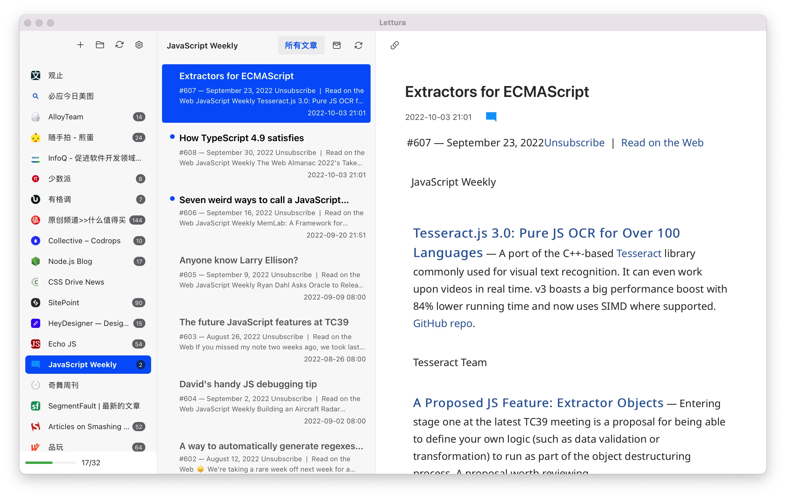

# Lettura 

  

Another free and open-source feed reader for macOS, maybe for Window in someday.

It supports RSS, Atom, JSON Feed.

And this project is under construction.

Pre-release version is [here](https://github.com/zhanglun/lettura/releases), you can download it and try to describe some feeds.

  

To be continued...
