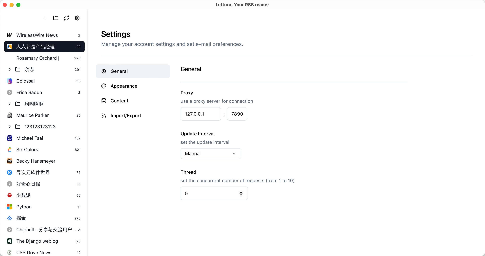
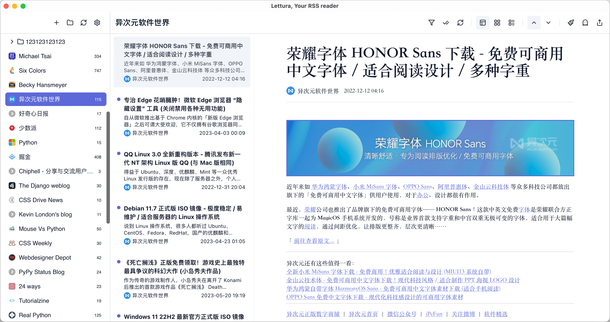
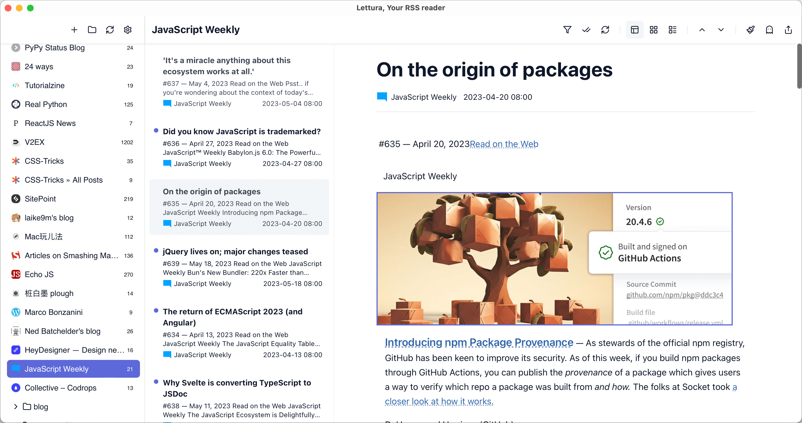
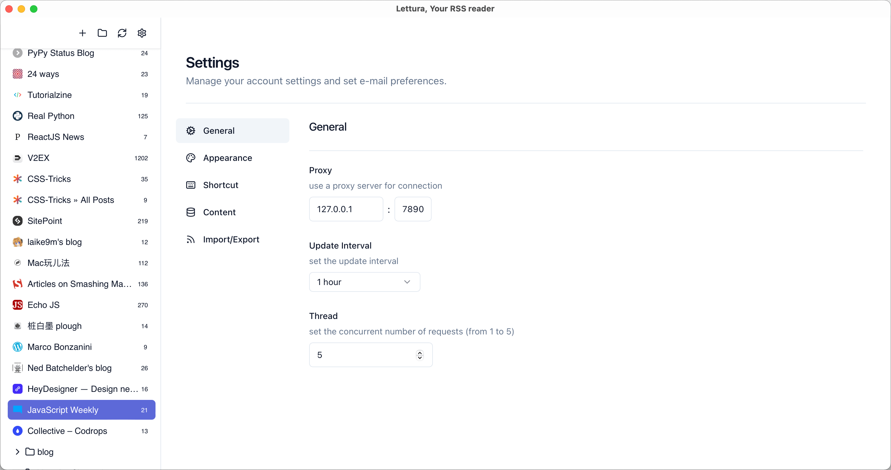
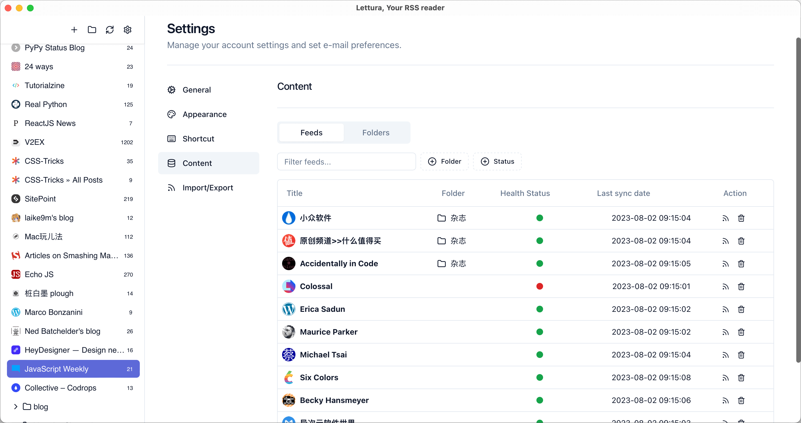

<p align="center">
  
</p>
<h1 align="center">Lettura</h1>

Another free and open-source feed reader for macOS and Window.

It supports RSS, Atom.

> JSON Feed support will coming soon

And this project is under construction.

Pre-release version is [here](https://github.com/zhanglun/lettura/releases), you can download it and try to subscribe some feeds.

<p align="center">
  
  
  
  
  
  
</p>


## Get Started

### Prerequisites

* Install Node.js. I recommend you to use [NVM](https://github.com/nvm-sh/nvm).
* Install pnpm. [Here](https://pnpm.io/installation) is the manual. 
* Install Rust. You can find way in [here](https://www.rust-lang.org/tools/install)
* Follow the [Tauri setup guide](https://tauri.app/v1/guides/getting-started/prerequisites)
* Run pnpm install

### Develop and Build

It is easy to start developing

```bash
pnpm tauri dev
```

And also easy to build. 

```bash
pnpm tauri build
```

You can get more details about building Tauri app in [here](https://tauri.app/v1/guides/distribution/publishing)


### More Projects

* [Pavo: mini desktop wallpaper application. ](https://github.com/zhanglun/pavo)
* [BookWise: book wise, read wiser](https://github.com/zhanglun/bookwise)
