# Lettura 技术架构方案 v0.1

> 基于 `prd/version-roadmap-v2.md` 的版本规划，支撑 Lettura 从 RSS Reader 演进到 Personal Intelligence Feed / Intelligence OS。

---

## 1. 设计原则

1. **单体模块化**：在现有 Tauri crate 内新增模块，不引入 sidecar 或独立服务
2. **只加不改**：新增模块和数据表，不重构现有 `core/`、`feed/`、`server/`
3. **增量 Pipeline**：AI 处理采用异步后处理模式，feed sync 完成后触发
4. **4 层架构**：Source → Pipeline → Intelligence → Product Service
5. **BYOK 模式**：用户自带 API Key，不托管模型、不训练数据
6. **最小依赖**：每个 minor 只引入必要的新依赖，避免一次性大升级

---

## 2. 系统架构

### 2.1 整体系统架构图

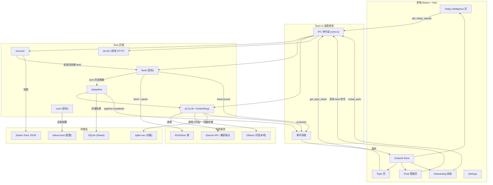

### 2.2 四层架构

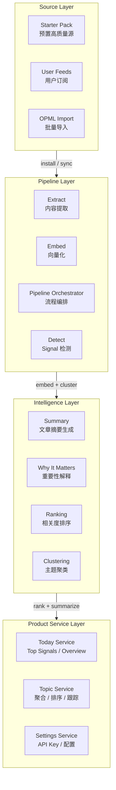

---

## 3. 核心业务流程

### 3.1 Feed Sync → AI Pipeline 完整流程

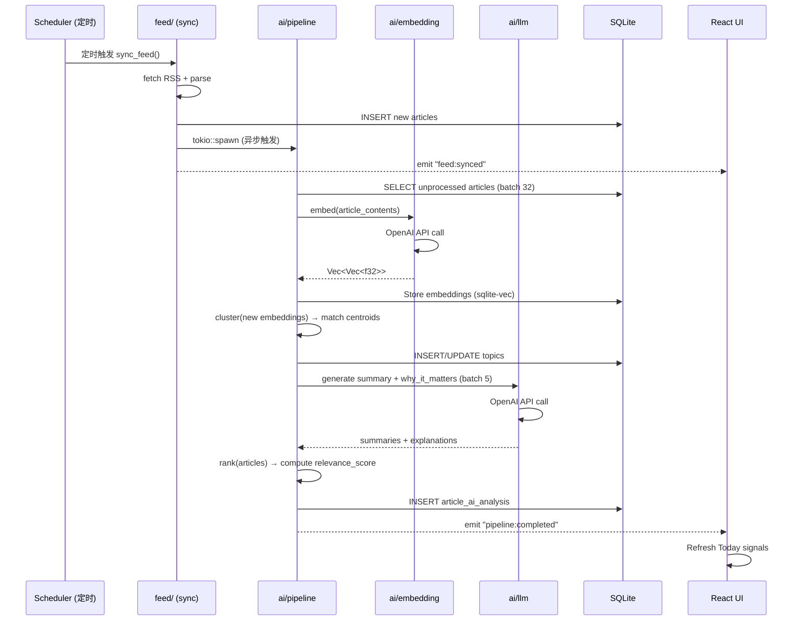

### 3.2 Onboarding 流程

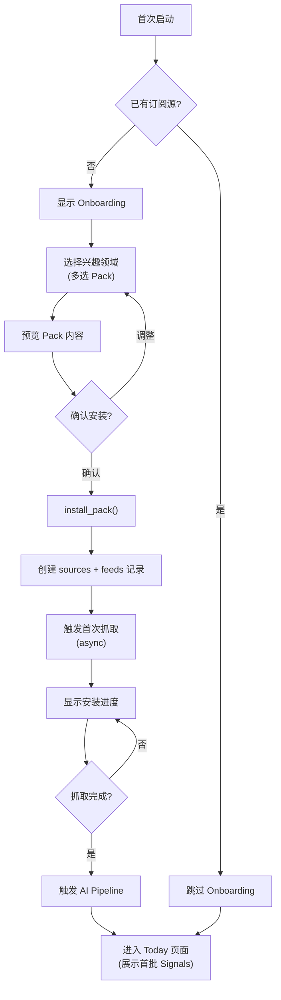

### 3.3 Today 页面交互流程

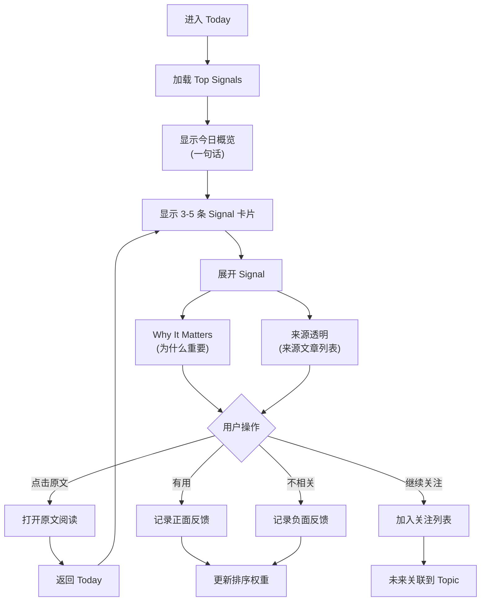

---

## 4. 产品功能流程

### 4.1 Signal 生命周期

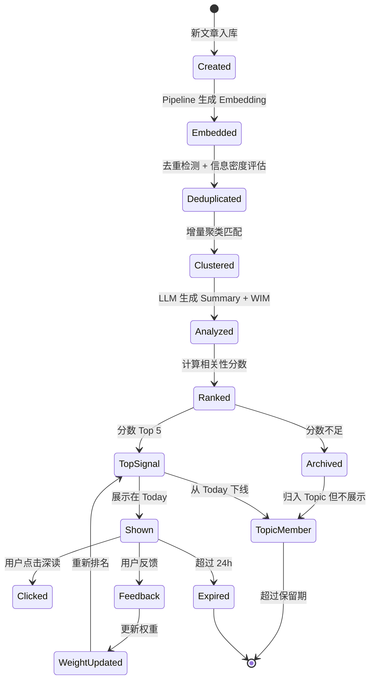

### 4.2 Topic 演化流程

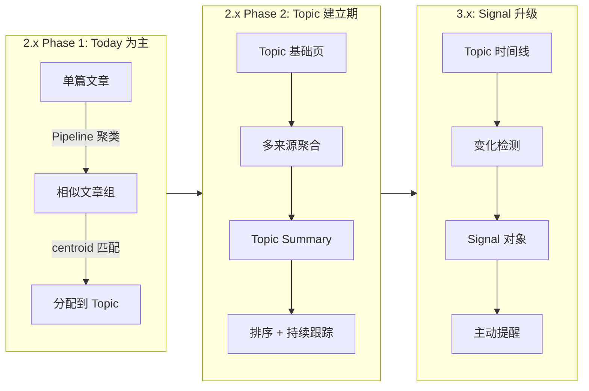

### 4.3 用户反馈闭环

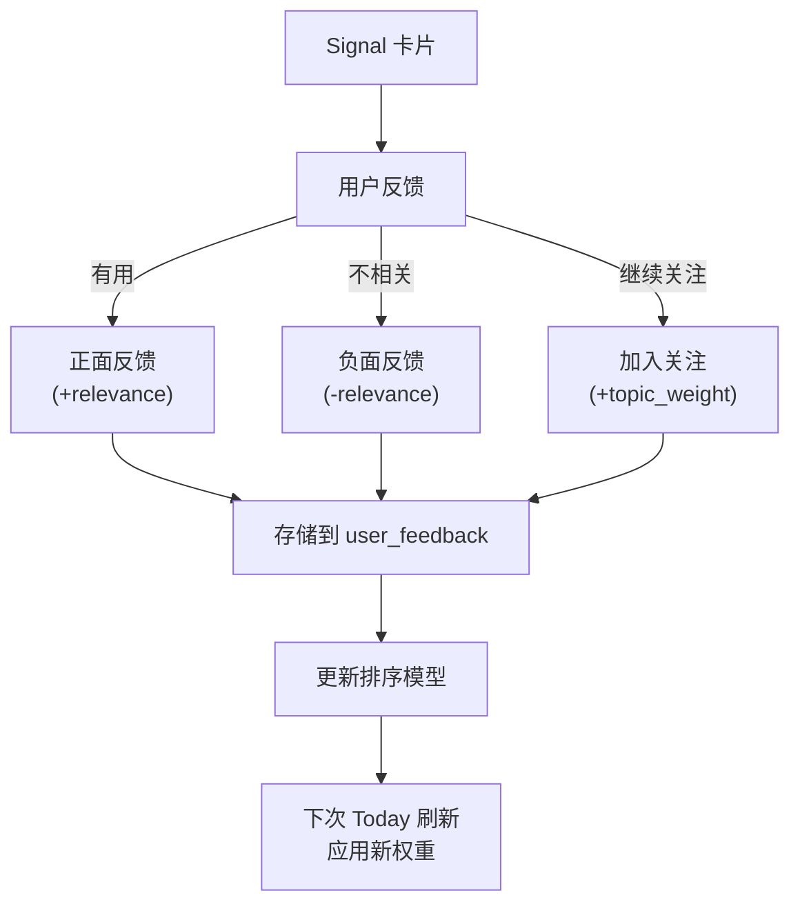

---

## 5. 数据关系

### 5.1 ER 图（完整数据模型）

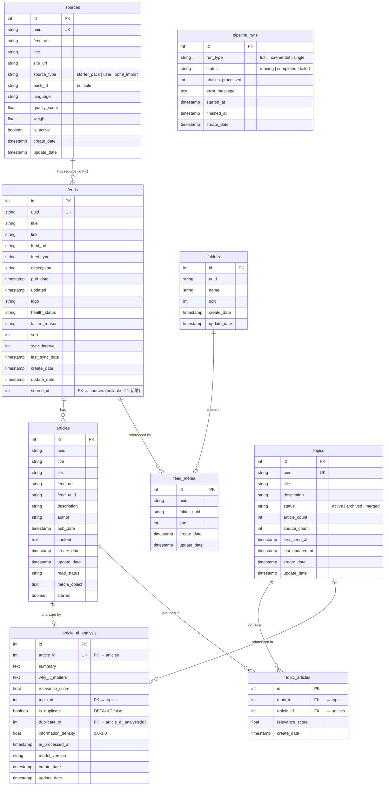

### 5.2 数据流向图

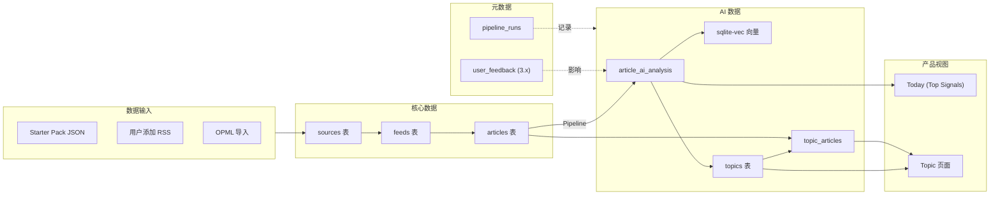

---

## 6. 模块结构

### 6.1 Rust 后端模块

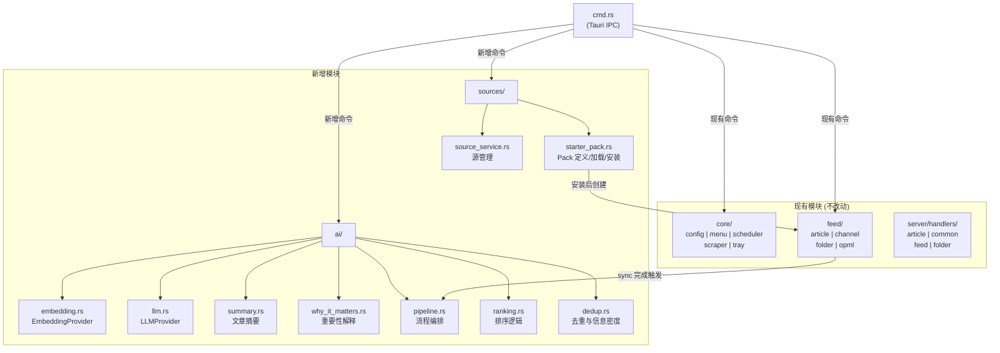

### 6.2 前端模块

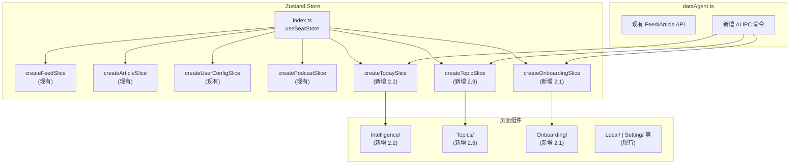

---

## 7. AI 能力设计

### 7.1 Embedding

```rust
// ai/embedding.rs
trait EmbeddingProvider {
    async fn embed(&self, texts: Vec<&str>) -> Result<Vec<Vec<f32>>>;
    fn dimension(&self) -> usize;
}

// 主方案：API 调用（text-embedding-3-small，1536 维）
struct OpenAIEmbedding { client: async_openai::Client, model: String }

// 后备方案：本地模型（candle + bge-small，384 维）
// 预留接口，2.x 暂不实现
struct LocalEmbedding { model_path: PathBuf }
```

选择理由：
- API 方案起步成本最低，不需要下载模型
- text-embedding-3-small 是性价比最优选择
- 本地模型作为离线后备，3.x 阶段再引入

### 7.2 LLM

```rust
// ai/llm.rs
trait LLMProvider {
    async fn complete(&self, prompt: &str, system: &str) -> Result<String>;
    async fn stream(&self, prompt: &str, system: &str) -> Result<impl Stream<Item = String>>;
}

// 统一接口：async-openai（支持 OpenAI / Ollama / 兼容端点）
struct OpenAILLM { client: async_openai::Client, model: String }
```

流式输出通过 Tauri 事件系统推送到前端：

```rust
app.emit("ai:stream", StreamChunk { content, done })?;
```

### 7.3 Pipeline 详细流程

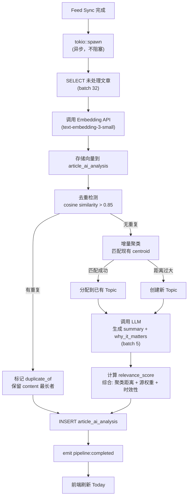

### 7.4 API Key 管理

- 当前阶段：明文存储在 `lettura.toml`（与现有 proxy 配置同模式）
- 配置项：`ai.api_key`、`ai.model`、`ai.embedding_model`、`ai.base_url`（支持自定义端点）
- 中期迁移：keyring crate 加密存储（3.x）

```toml
# lettura.toml
[ai]
api_key = "sk-..."
model = "gpt-4o-mini"
embedding_model = "text-embedding-3-small"
base_url = "https://api.openai.com/v1"  # 可改为 Ollama 等本地端点

[app]
onboarding_completed = false  # 首次启动后设为 true
```

---

## 8. Starter Pack 设计

### 8.1 数据结构

```json
{
  "id": "ai",
  "name": "AI & Machine Learning",
  "description": "跟踪 AI 领域最重要的技术突破、产品动态和行业趋势",
  "icon": "brain",
  "sources": [
    {
      "name": "OpenAI Blog",
      "feed_url": "https://openai.com/blog/rss.xml",
      "site_url": "https://openai.com/blog",
      "language": "en",
      "quality_score": 0.95
    }
  ]
}
```

### 8.2 Pack 存储位置

```
apps/desktop/src-tauri/src/sources/packs/
  ai.json
  developer.json
  startup.json
  product.json
  design.json
  science.json
  business.json
  tech-news.json
```

### 8.3 IPC 命令

```rust
// 新增 3 个 Tauri IPC 命令（apps/desktop/src-tauri/src/cmd.rs）
#[command]
fn get_starter_packs() -> Result<Vec<StarterPack>, String>;

#[command]
fn preview_pack(pack_id: String) -> Result<StarterPack, String>;

#[command]
async fn install_pack(pack_ids: Vec<String>) -> Result<InstallResult, String>;
```

### 8.4 安装流程

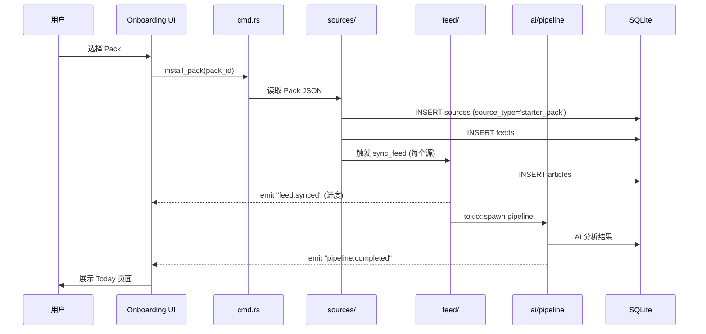

### 8.5 源质量筛选原则

- ✅ 选：官方博客、专家博客、深度分析、原始信息源
- ❌ 不选：内容农场、纯转载站、垃圾 SEO、高频低质量内容
- 每个 Pack 15-20 个高质量源
- 首批 8 个 Pack

---

## 9. 前端集成

### 9.1 新增 Zustand Slice

```typescript
// stores/onboardingSlice.ts（2.1）
interface OnboardingState {
  packs: StarterPack[];
  selectedPacks: string[];
  status: 'idle' | 'selecting' | 'installing' | 'done';
  progress: { current: number; total: number };
}

// stores/todaySlice.ts（2.2+）
interface TodayState {
  signals: Signal[];
  overview: string;
  loading: boolean;
  lastUpdated: string;
}

// stores/topicSlice.ts（2.9+）
interface TopicState {
  topics: Topic[];
  selectedTopic: Topic | null;
  loading: boolean;
}
```

### 9.2 新增 Tauri IPC 调用

```typescript
// helpers/dataAgent.ts 扩展
const AI_COMMANDS = {
  getStarterPacks: () => invoke('get_starter_packs'),
  previewPack: (id: string) => invoke('preview_pack', { packId: id }),
  installPack: (id: string) => invoke('install_pack', { packId: id }),
  getTodaySignals: () => invoke('get_today_signals'),
  getTopicDetail: (id: number) => invoke('get_topic_detail', { topicId: id }),
  submitFeedback: (articleId: number, type: string) => invoke('submit_feedback', { articleId, type }),
};
```

### 9.3 Tauri 事件监听

```typescript
// App.tsx 扩展
listen('pipeline:completed', () => { /* 刷新 Today */ });
listen('feed:synced', (event) => { /* 更新 Onboarding 进度 */ });
listen('ai:stream', (event) => { /* 流式接收 AI 输出 */ });
```

---

## 10. 版本演进与依赖

### 10.1 2.x Minor 版本依赖关系

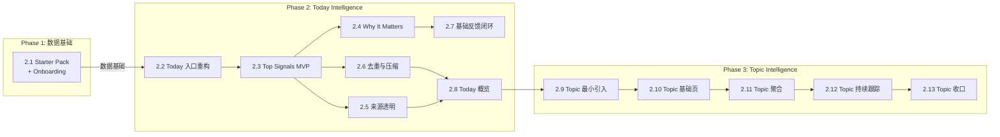

### 10.2 技术范围与新增映射

| Minor | 技术范围 | 新增模块/表 | 关键依赖 |
|-------|---------|------------|---------|
| 2.1 Starter Pack + Onboarding | sources/ 模块 + Pack JSON + Onboarding UI | sources 表, feeds 增加 source_id 列, 3 个 IPC 命令, onboardingSlice | — |
| 2.2 Today 入口重构 | Today 页面重构为 Intelligence 入口 | todaySlice, Intelligence/ 组件 | — |
| 2.3 Top Signals MVP | AI Pipeline 最小版 + Signal 卡片 | ai/ 模块, article_ai_analysis, pipeline_runs | async-openai |
| 2.4 Why It Matters | LLM 生成解释 | ai/llm.rs, ai/why_it_matters.rs | async-openai |
| 2.5 来源透明 | 展示来源文章 | SignalSourceList 组件 | — |
| 2.6 去重与压缩 | 内存 cosine similarity 去重 + 信息密度评估 | ai/dedup.rs, article_ai_analysis 增加 3 列 | — |
| 2.7 基础反馈闭环 | 用户反馈记录 | user_feedback 表 | — |
| 2.8 Today 概览 | 一句话概览生成 | ai/summary.rs 扩展 | — |
| 2.9 Topic 最小引入 | Topic 对象 + 关联 | topics, topic_articles, ai/ranking.rs | — |
| 2.10 Topic 基础页 | Topic 展示页 | Topics/ 组件, topicSlice | — |
| 2.11 Topic 聚合 | 多来源归组 + 多观点 | topic 排序逻辑 | — |
| 2.12 Topic 持续跟踪 | 排序 + Continue Tracking | 兴趣权重逻辑 | — |
| 2.13 Topic 收口 | 验证 + 判断 | — | — |

---

## 11. 依赖规划

### 11.1 新增 Rust 依赖（2.x）

```toml
# apps/desktop/src-tauri/Cargo.toml

# AI 核心
async-openai = "0.25"      # LLM + Embedding API 调用

# 向量存储（2.3+ 引入）
# sqlite-vec 通过 rusqlite extension 加载

# 聚类（2.5+ 引入）
# hdbscan = "0.3"          # HDBSCAN 聚类
# ndarray = "0.16"         # 数值计算
```

### 11.2 新增前端依赖

```json
{
  "lucide-react": "^0.x",   // 图标（已有则跳过）
  "framer-motion": "^11.x"   // Signal 卡片动画（可选）
}
```

### 11.3 不引入的依赖

- ❌ Sidecar / 独立服务
- ❌ 本地 LLM 运行时（2.x 阶段）
- ❌ candle / hf-hub / tokenizers（3.x 离线后备时再引入）
- ❌ 任务队列框架（Pipeline 内部管理即可）

---

## 12. 技术风险与缓解

| 风险 | 影响 | 缓解 |
|------|------|------|
| API 调用成本超预期 | 用户流失 | BYOK + 本地后备 + 批量处理 + 缓存 |
| sqlite-vec 性能不足 | 聚类/去重变慢 | 增量聚类 + 定期校正 + 限制文章数量 |
| Pipeline 阻塞主线程 | UI 卡顿 | tokio::spawn 异步 + 进度通知 |
| Embedding 模型变更 | 向量不兼容 | model_version 字段 + 版本迁移脚本 |
| Starter Pack 源失效 | 数据质量下降 | health_status 监控 + 定期审核 |

---

## 13. 不做的事

- ❌ 不重构现有 `core/`、`feed/`、`server/` 模块
- ❌ 不引入 sidecar 或独立服务
- ❌ 不构建完整 Job Engine（Pipeline 内部管理即可）
- ❌ 不使用 8 层架构（4 层足够）
- ❌ 不在本阶段实现本地 LLM / 本地 Embedding
- ❌ 不做内容平台——Starter Pack 的源全部是外部 RSS
