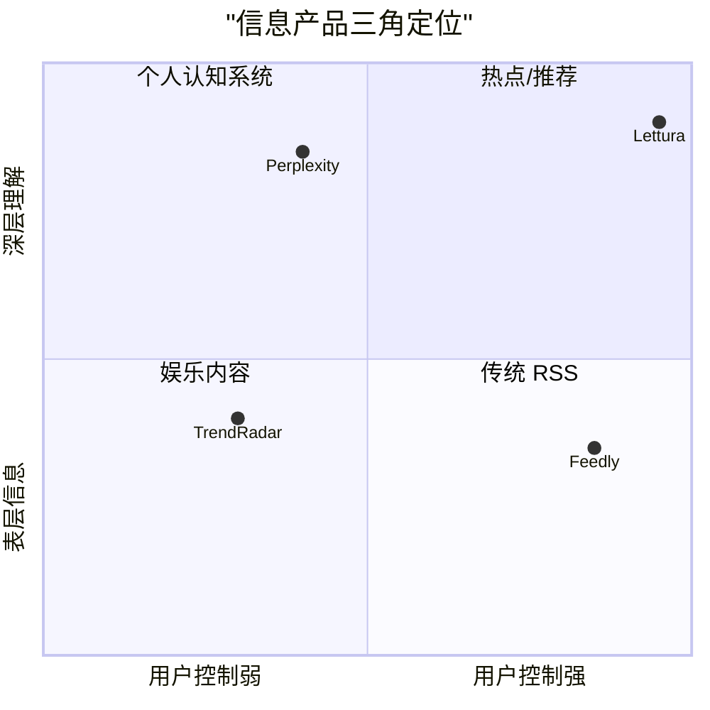
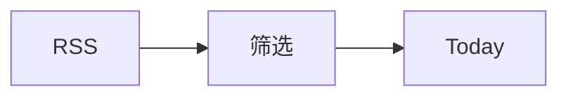
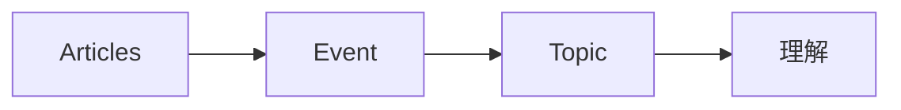
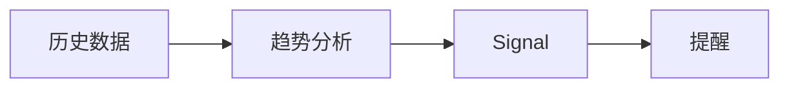
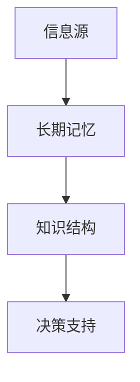
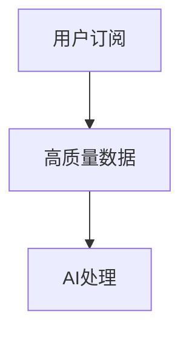
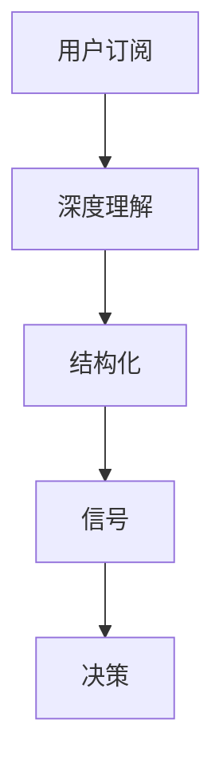
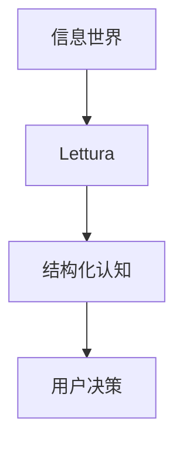

很好，这一步我们就把你的产品从“方向正确”推进到：

> **可以长期发展、不会走偏、甚至有机会长出来的产品战略**

我会帮你做三件事（都非常关键）：

1. **画清楚你在整个市场中的“不可替代位置”**
2. **给出 1–3 年的产品演化路径（不是功能，是能力进化）**
3. **明确你未来要坚持 & 绝对不能做的方向**

---

# 🧭 一、先锁死你的产品边界（非常关键）

你现在夹在三类产品之间：

* RSS 工具（Feedly）
* AI 搜索（Perplexity AI）
* 热点雷达（TrendRadar）

但你真正要占的位置是：



---

## 🎯 你要占的点：

> **高用户控制 + 高认知深度**

这就是你的护城河。

---

# 🧠 二、长期产品进化路径（1 → 3 年）

我们不按“版本”，而按“能力层级”看（更真实）

---

## 🥇 阶段 1（0–6 个月）

### 👉 定位：AI 信息过滤器



### 用户价值：

* 不用看全部
* 每天只看 5~10 条

---

### 核心能力：

* Selection（排序）
* Dedup（去重）
* Summary（压缩）
* Why it matters（解释 v1）

---

### 成功标志：

👉 用户打开 App 的第一行为：

> “看看今天有什么重要的”

而不是：

> “刷列表”

---

## 🥈 阶段 2（6–12 个月）

### 👉 定位：AI 信息理解系统



---

### 用户价值：

* 不只是知道“发生了什么”
* 而是知道：

  * 这是什么趋势
  * 为什么重要

---

### 核心能力：

* Event 聚合（多篇 → 一件事）
* Topic 分类（主题层）
* 多观点整合
* Topic-level summary

---

### 成功标志：

👉 用户开始说：

> “我用这个看趋势”

---

## 🥉 阶段 3（12–24 个月）

### 👉 定位：个人信息雷达



---

### 用户价值：

* 不用主动看
* 系统告诉你变化

---

### 核心能力：

* Signal detection（趋势）
* anomaly detection（异常）
* 用户兴趣模型
* 主动提示

---

### 成功标志：

👉 用户会说：

> “这个东西会提醒我重要变化”

---

## 🏁 阶段 4（2–3 年）

### 👉 定位：Personal Intelligence OS



---

### 用户价值：

* 不只是消费信息
* 而是形成自己的认知体系

---

### 核心能力：

* 长期知识积累
* 跨时间分析
* 个人知识图谱
* AI 辅助判断

---

### 成功标志：

👉 用户依赖你来：

* 做判断
* 追踪领域
* 做研究

---

# 🧠 三、你的产品真正“护城河”在哪里？

不是技术，而是这三件事：

---

## 1️⃣ 用户主动数据（最重要）



👉 这是你 vs Perplexity 的核心差异

---

## 2️⃣ 长期记忆

* 用户历史
* topic 演化
* 阅读行为

👉 这是 TrendRadar 做不到的

---

## 3️⃣ 认知深度

* 不只是 summary
* 而是：

  * why
  * implications
  * connections

---

# ⚠️ 四、未来发展中最危险的三条路

## ❌ 1. 变成“AI RSS reader”

症状：

* 加 summary
* UI 更好
* 但还是列表

👉 会死在中间层

---

## ❌ 2. 变成“TrendRadar lite”

症状：

* 加热点
* 加榜单
* 加推送

👉 会输给数据规模

---

## ❌ 3. 变成“Perplexity clone”

症状：

* 加 chat
* 加搜索

👉 完全打不过

---

# 🚀 五、正确发展策略（核心）

## 👉 你的唯一方向：



---

# 🧭 六、产品发展三条主线（必须同时推进）

---

## 🧩 主线 1：信息压缩 → 信息选择

* summary
* Top N
* ranking

👉 解决“太多”

---

## 🧠 主线 2：信息 → 结构

* article → event → topic

👉 解决“太碎”

---

## 📡 主线 3：静态 → 动态

* topic → trend → signal

👉 解决“看不到变化”

---

# 🧠 七、一个你必须坚持的产品哲学

> ❗ **减少信息，而不是增加信息**

---

## 所有功能必须回答：

```text
这个功能是否让用户：
1. 看更少？
2. 理解更深？
3. 判断更快？
```

否则就不做。

---

# 🧭 八、你的产品最终形态（非常关键）

不是：

* 阅读器
* 新闻工具
* AI 助手

而是：

> **“认知基础设施”**

---



---

# 🔚 最后一段（非常关键）

你现在已经走在一个很少人真正走通的路径上：

👉 从 RSS → AI → 情报系统

---

但这个路径有一个关键要求：

> ❗ **必须持续往“更少、更深、更准”走**

---

# 👍 下一步建议（非常重要）

我们可以继续往一个更关键的方向深入：

👉 **设计“第一版 Today 页面（完整产品稿）”**

因为：

> 这是整个产品转型能否成功的“起点”

如果这里没做好，后面所有规划都会失效。
