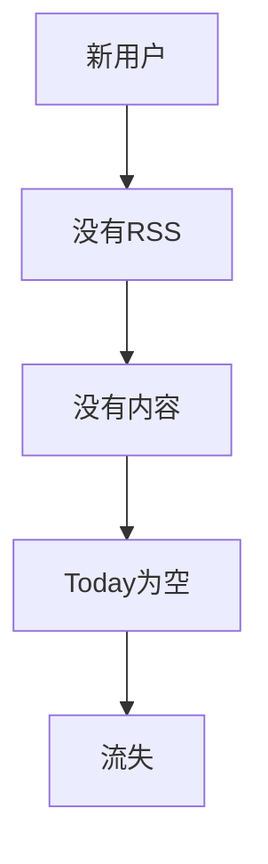
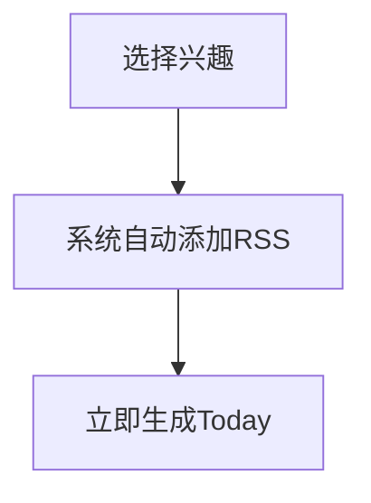
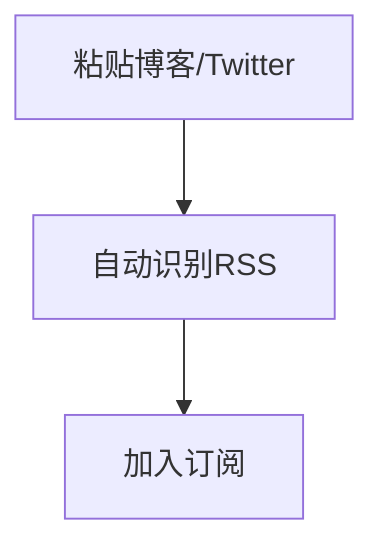
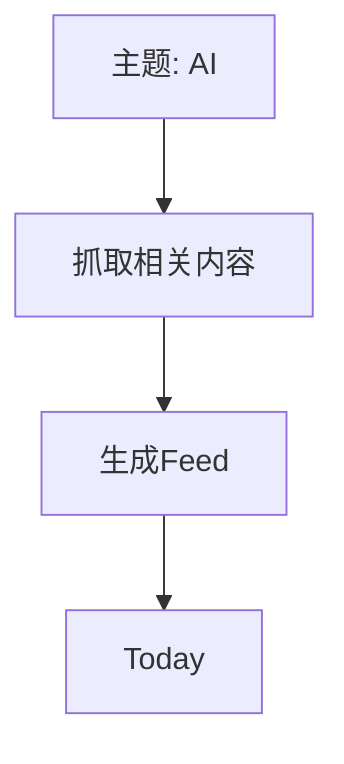
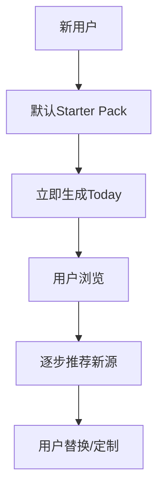

这个问题你问得非常关键，而且这是**这个产品成败的第一道坎**：

> ❗用户没有数据源 → AI 再强也没用

很多 RSS 产品死在这里，不是因为体验不好，而是：

> **用户第一天打开是空的**

---

# 🧭 一、先把问题本质说清楚

用户初始状态：



👉 这是必须解决的“冷启动问题”

---

# 🧠 二、核心思路：不要让用户“自己构建数据源”

你不能指望用户：

* 手动找 RSS
* 导入 OPML
* 自己配置

👉 这在 2026 年已经是“高门槛行为”

---

## ✅ 正确方向

> **系统先给用户“可用的信息流”，再逐步让用户接管**

---

# 🚀 三、冷启动的 4 种解决方案（必须组合用）

我按优先级帮你排好：

---

# 🥇 方案 1：Starter Packs（默认信息包）【最重要】

## 🎯 思路

给用户一个“开箱即用”的信息源集合

---

## 示例

用户第一次打开：



---

## 可以提供的 Pack

### 🧑‍💻 开发者包

* Hacker News
* GitHub Trending
* 技术博客

### 🤖 AI 包

* AI 研究
* 产品动态
* 工具更新

### 🚀 创业包

* 产品
* 增长
* VC/市场

---

## 🔥 关键点

👉 不要让用户选很多
👉 **默认直接给一个**

---

## 🎯 本质

> 用你的判断替代用户的冷启动成本

---

# 🥈 方案 2：URL / Twitter / Blog 自动转 RSS

## 🎯 思路

用户不会找 RSS，但会：

* 复制网址
* 关注人

---

## 体验



---

## 支持：

* 博客 URL
* Substack
* Twitter / X
* YouTube（后期）

---

## 🎯 本质

👉 降低 RSS 使用门槛

---

# 🥉 方案 3：系统推荐数据源（轻量）

## 🎯 思路

在使用过程中慢慢推荐

---

## 例子

在 Today 中出现：

```text
你似乎关注 AI Coding
推荐添加：
- 某博客
- 某作者
```

---

## 注意

👉 不要像推荐流
👉 要“克制 + 精准”

---

# 🧠 方案 4：AI 生成“虚拟 Feed”（高级）

这个是进阶玩法（后期）

---

## 思路

即使没有 RSS，也可以：



---

## 但注意

👉 这会让你靠近：

* TrendRadar
* Perplexity

👉 所以要控制比例

---

# 🧭 四、最佳组合策略（建议你用这个）

## 👉 冷启动三步走



---

## 🎯 原则

### 1️⃣ 第一次必须“有内容”

👉 不能空

---

### 2️⃣ 内容必须“看起来很聪明”

👉 让用户觉得：

> “这个工具很懂我”

---

### 3️⃣ 逐步交还控制权

👉 从系统 → 用户

---

# 🧠 五、产品体验设计（非常关键）

## ❌ 错误 onboarding

```text
请选择你要添加的RSS
```

👉 直接劝退

---

## ✅ 正确 onboarding

```text
你想关注什么？

[AI] [编程] [创业]

👉 已为你准备好内容
```

---

## 然后：

👉 直接进入 Today（有内容）

---

# 🧠 六、未来升级路径（数据源层）

---

## 🥇 初期（1.x）

* Starter packs
* RSS 为主

---

## 🥈 中期（2.x）

* RSS + Newsletter
* RSS + Twitter（精选）

---

## 🥉 后期（3.x）

* 用户知识图谱驱动
* 自定义信号源

---

# ⚠️ 七、你必须避免的坑

---

## ❌ 坑 1：做成“推荐流”

👉 会变成另一个内容 App

---

## ❌ 坑 2：让用户自己配置一切

👉 99% 用户不会做

---

## ❌ 坑 3：数据源太杂

👉 会变成噪音

---

# 🧠 八、一个非常重要的产品判断

👉 你的产品不是：

> “RSS 管理工具”

而是：

> **“高质量信息入口”**

---

# 🔚 最关键的一句话

> ❗ **冷启动不是“用户的问题”，是“产品必须解决的问题”**

---

# 👍 下一步建议

我们可以继续往下拆一个非常关键的点：

👉 **设计“Onboarding + Starter Pack 的完整体验流程”**

这个直接决定：

* 用户会不会留下
* 会不会觉得你“很聪明”

这一步比 AI 模型还重要。
