下面是一份 **Lettura AI 时代产品设计规划 v0.1**。
定位不是“RSS 阅读器升级”，而是：

> **从 RSS Reader 进化为 Personal Intelligence Feed / 个人信息雷达。**

---

# 1. 产品愿景

## 1.1 一句话定位

> Lettura 是一个基于用户可信信息源的 AI 个人情报流，帮助用户从海量内容中发现真正重要的信号。

## 1.2 核心价值

用户不再需要逐篇阅读，而是每天获得：

* 今天最重要的内容
* 正在浮现的趋势
* 多来源整合后的事件
* 为什么这些内容重要
* 可以继续追问的信息上下文

---

# 2. 产品边界

## 2.1 Lettura 不应该是什么

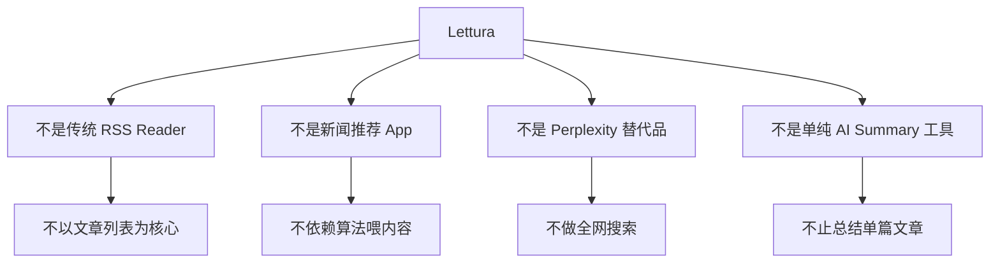

## 2.2 Lettura 应该是什么

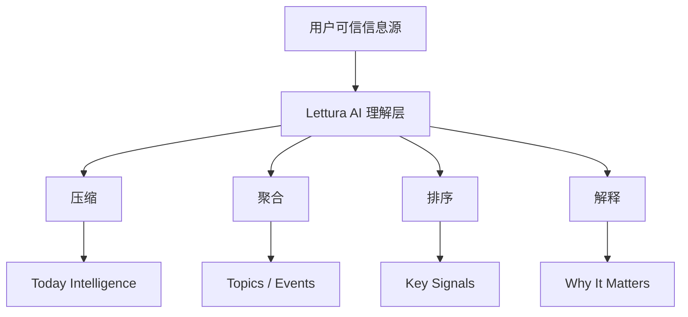

---

# 3. 目标用户

## 3.1 第一阶段核心用户

优先服务：

* 开发者
* 独立开发者
* 技术创作者
* 产品经理
* 创业者
* 研究型知识工作者

他们共同的问题是：

> 信息源很多，但真正有价值的信息很少。

## 3.2 用户画像

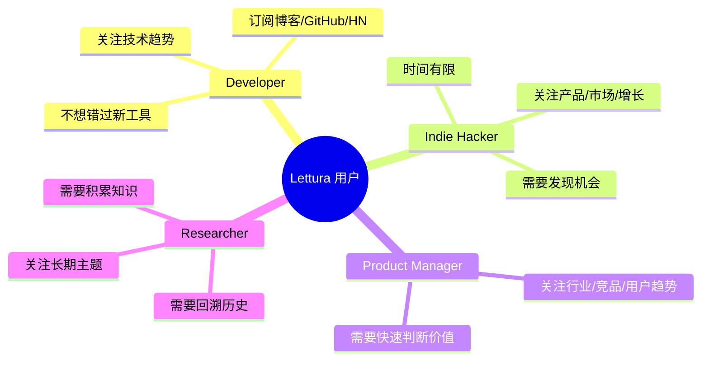

---

# 4. 核心产品假设

## 假设 1

用户真正想要的不是“更多内容”，而是“更少但更重要的内容”。

## 假设 2

RSS 的价值不在于阅读体验，而在于它是高质量、用户主动选择的信息源。

## 假设 3

AI 的核心作用不是生成摘要，而是帮助用户完成：

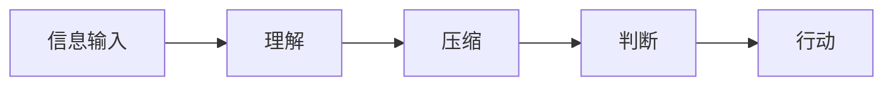

## 假设 4

Lettura 的核心竞争力应该建立在：

> 用户控制的信息源 + AI 结构化理解 + 长期信息记忆

---

# 5. 产品核心模型

## 5.1 从 Article 到 Signal

传统 RSS 的核心对象是 Article。
未来 Lettura 的核心对象应该升级为 Signal。

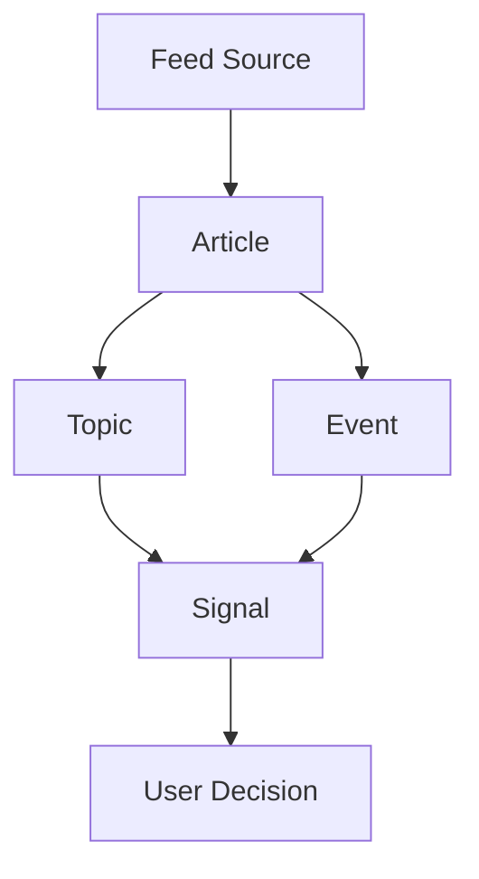

## 5.2 信息层级

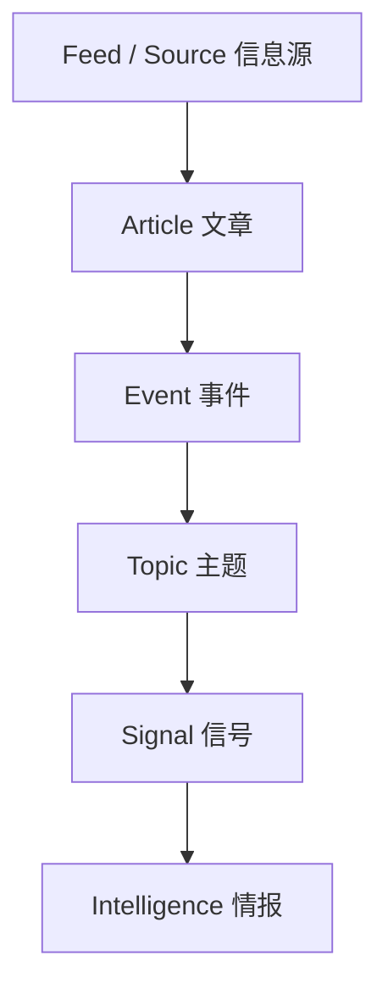

解释：

* **Article**：单篇文章
* **Event**：多篇文章描述的同一件事
* **Topic**：长期关注主题
* **Signal**：值得用户注意的变化
* **Intelligence**：经过解释后的结论

---

# 6. 产品信息架构

## 6.1 当前旧结构

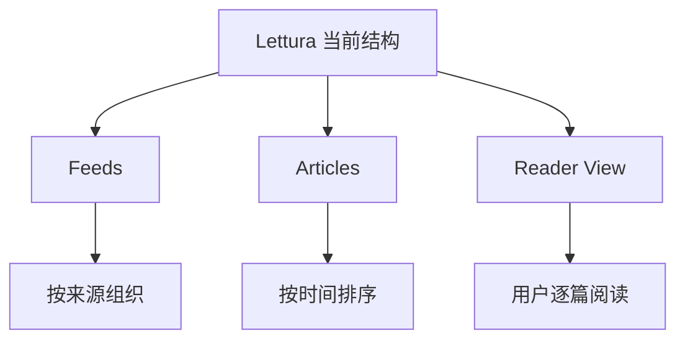

## 6.2 未来新结构

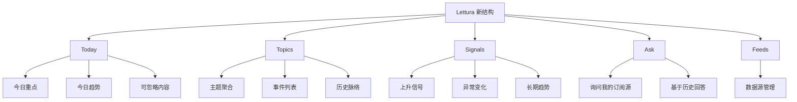

核心变化：

> Feeds 从主角变成数据源，Today / Topics / Signals 成为主角。

---

# 7. 核心页面设计

## 7.1 Today 页面

Today 是产品第一入口。

### 页面目标

用户打开 Lettura 后，第一眼就知道：

> 今天我应该关注什么？

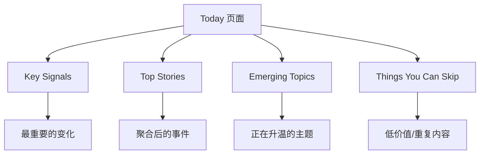

### 内容结构

每条内容建议包含：

```text
标题
一句话结论
为什么重要
来源数量
相关原文
用户操作：收藏 / 忽略 / 深入查看 / 追问
```

---

## 7.2 Topic 页面

Topic 页面不是分类列表，而是主题空间。

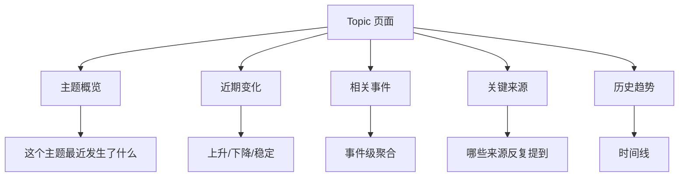

示例：

```text
Topic: AI Coding Tools

最近变化：
AI 编程助手正在从 autocomplete 转向 agentic workflow。

关键事件：
1. 某工具发布新版本
2. 多篇博客讨论 agent-based coding
3. 开发者社区出现反思声音

为什么重要：
这可能改变开发者 IDE 工作流。
```

---

## 7.3 Signal 页面

Signal 是 Lettura 的高级形态。

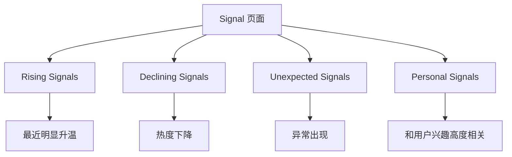

Signal 的重点不是“发生了什么”，而是：

> 有什么变化值得注意？

---

## 7.4 Ask 页面

Ask 不是主入口，应该是辅助入口。

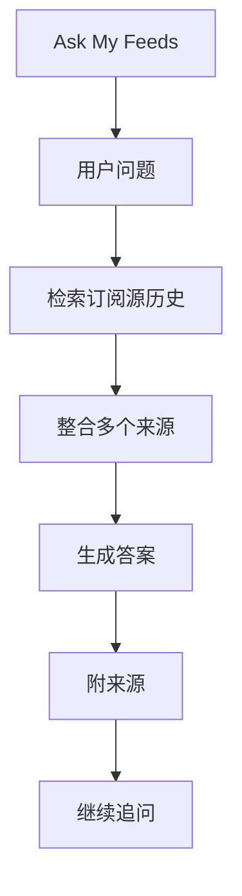

典型问题：

```text
最近大家怎么看 Tauri？
过去一个月 AI coding tools 有什么变化？
我订阅源里有没有提到 RSS 复兴？
哪些文章值得我收藏？
```

---

# 8. 用户旅程

## 8.1 每日使用路径

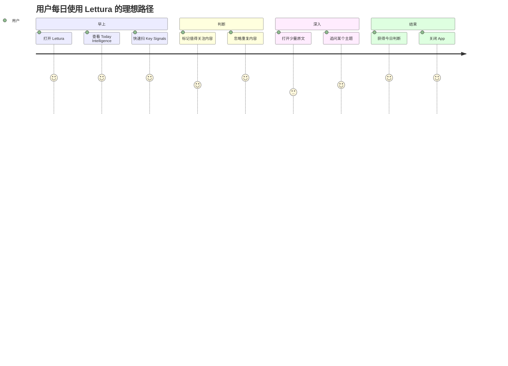

## 8.2 产品希望改变的行为

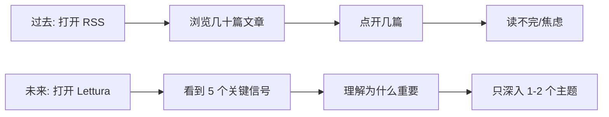

---

# 9. 功能优先级

## 9.1 产品能力分层

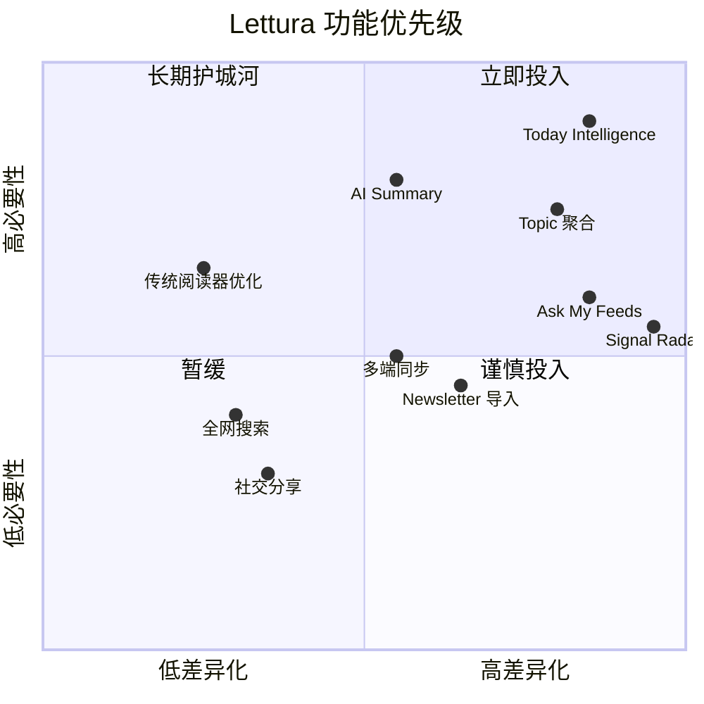

## 9.2 第一优先级

必须先做：

1. Today Intelligence
2. Key Signals
3. Why It Matters
4. Topic 聚合
5. 基础反馈机制

## 9.3 暂时不要做

暂时不要投入：

* 社交功能
* 内容社区
* 全网搜索
* 复杂 Agent
* 太重的笔记系统
* 过度阅读器美化

---

# 10. 产品路线图

## 10.1 总体路线

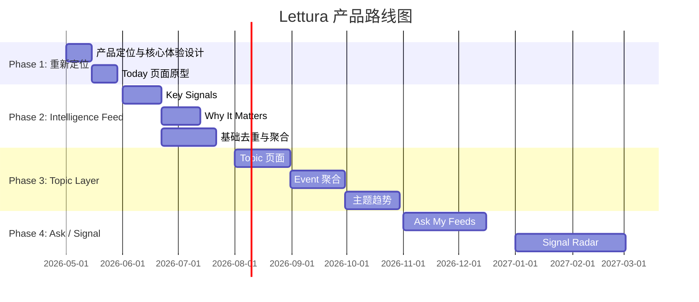

时间只是规划草案，后续可根据你的投入节奏调整。

---

# 11. 分阶段产品目标

## Phase 1：从 Reader 到 Today

### 目标

让用户打开 App 后第一眼看到“结果”，而不是文章列表。

### 核心问题

> 今天我应该关注什么？

### 产品形态

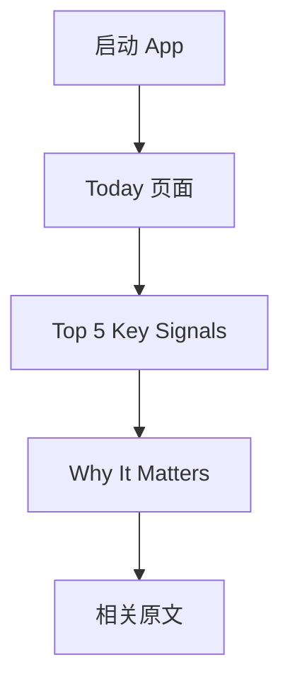

### 成功标准

* 用户愿意每天打开 Today
* 用户不再需要浏览全部文章
* 用户认为摘要“足够可信”

---

## Phase 2：从 Article 到 Topic

### 目标

让用户从“按文章消费”转向“按主题理解”。

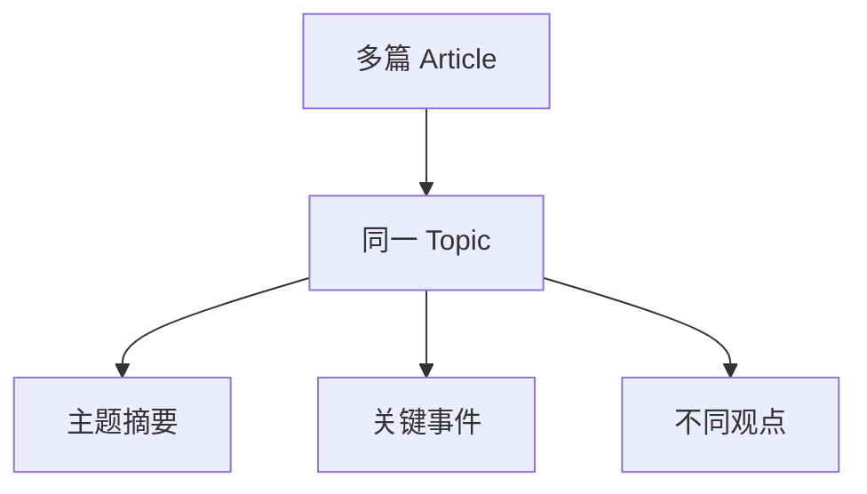

### 成功标准

* 用户通过 Topic 找内容，而不是 Feed
* 用户理解一个主题的近期变化
* 重复内容显著减少

---

## Phase 3：从 Topic 到 Signal

### 目标

让 Lettura 主动指出变化。

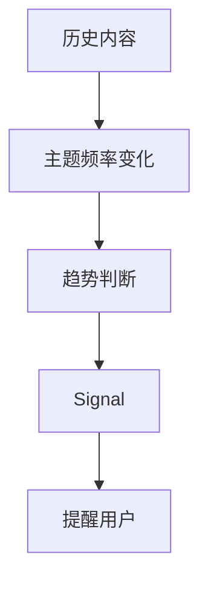

### 成功标准

* 用户觉得 Lettura 能发现自己没注意到的事情
* Signal 页面成为高频入口
* 用户开始依赖它做信息判断

---

## Phase 4：从 Signal 到 Intelligence OS

### 目标

Lettura 成为长期个人信息系统。

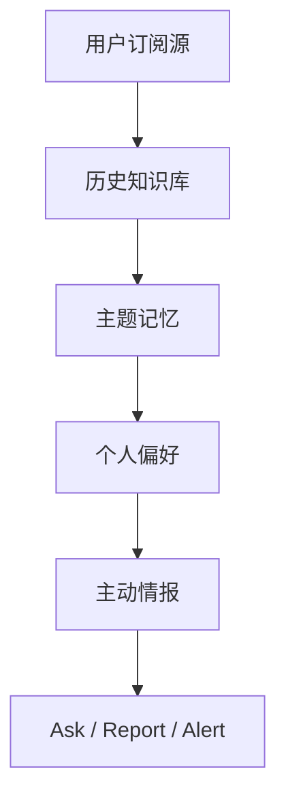

---

# 12. 产品体验原则

## 原则 1：默认给结论

不要让用户先看列表。

```text
错误：
这里有 100 篇文章，请慢慢看。

正确：
今天真正值得看的有 5 件事。
```

## 原则 2：每个内容都回答“为什么重要”

摘要不是终点。

```text
发生了什么？
为什么重要？
对我有什么影响？
我要不要继续看？
```

## 原则 3：来源必须透明

AI 不能黑箱。

每个结论都应该能展开看到：

* 来源文章
* 来源网站
* 发布时间
* 相关原文

## 原则 4：用户必须可控

Lettura 不应该变成另一个推荐流。

用户应该可以告诉系统：

* 这个主题重要
* 这个来源不重要
* 这个内容以后少出现
* 这个方向继续跟踪

---

# 13. 首页 Today 详细结构

## 13.1 页面草图

```mermaid
flowchart TD
    A[Today Intelligence] --> B[Header: 今日概览]
    B --> C[一句话总结今天的信息状态]

    A --> D[Section 1: Key Signals]
    D --> D1[Signal Card 1]
    D --> D2[Signal Card 2]
    D --> D3[Signal Card 3]

    A --> E[Section 2: Emerging Topics]
    E --> E1[Topic Card 1]
    E --> E2[Topic Card 2]

    A --> F[Section 3: Worth Reading]
    F --> F1[精选原文 1]
    F --> F2[精选原文 2]

    A --> G[Section 4: Low Priority]
    G --> G1[重复/低价值内容归档]
```

## 13.2 Signal Card 内容

```text
标题：
AI Coding Tools 正在从补全走向 Agent

一句话结论：
多个来源都在讨论“自动执行任务”的开发工具，而不是简单代码补全。

为什么重要：
这可能改变开发者与 IDE 的关系，影响未来开发工作流。

来源：
5 篇文章 · 3 个来源

操作：
深入查看 / 忽略 / 跟踪该主题 / 询问
```

---

# 14. 产品关键指标

## 14.1 北极星指标

> 用户每周通过 Lettura 识别到的有效信息信号数量。

更简单地说：

> Lettura 每周帮用户发现了多少“值得注意”的东西。

## 14.2 阶段指标

```mermaid
flowchart TD
    A[Phase 1] --> A1[Today 打开率]
    A --> A2[摘要满意度]
    A --> A3[原文点击率下降但满意度上升]

    B[Phase 2] --> B1[Topic 页面使用率]
    B --> B2[重复文章减少率]
    B --> B3[用户收藏 Topic 数]

    C[Phase 3] --> C1[Signal 点击率]
    C --> C2[Signal 反馈准确率]
    C --> C3[主动提醒留存率]

    D[Phase 4] --> D1[Ask 使用率]
    D --> D2[历史查询成功率]
    D --> D3[周留存]
```

---

# 15. 商业模式方向

## 15.1 不建议一开始商业化

早期重点是验证：

* Today 是否有价值
* 用户是否愿意信任 AI 筛选
* 用户是否愿意从 Reader 迁移到 Intelligence Feed

## 15.2 未来可能模式

```mermaid
flowchart TD
    A[免费版] --> A1[传统 RSS 阅读]
    A --> A2[基础 Today]

    B[Pro 版] --> B1[高级 AI Digest]
    B --> B2[Ask My Feeds]
    B --> B3[Signal Radar]
    B --> B4[长期历史搜索]
    B --> B5[多设备同步]

    C[Team 版] --> C1[共享信息源]
    C --> C2[团队情报简报]
    C --> C3[行业监控]
```

---

# 16. 竞争定位

## 16.1 产品定位图

```mermaid
quadrantChart
    title 信息产品定位
    x-axis 用户控制弱 --> 用户控制强
    y-axis AI 理解弱 --> AI 理解强
    quadrant-1 AI 推荐流
    quadrant-2 Lettura 目标区
    quadrant-3 传统资讯流
    quadrant-4 传统 RSS

    传统新闻 App: [0.2, 0.25]
    传统 RSS Reader: [0.85, 0.25]
    Perplexity: [0.35, 0.85]
    Feedly: [0.75, 0.45]
    AI Newsletter Digest: [0.45, 0.65]
    Lettura Future: [0.9, 0.85]
```

## 16.2 核心差异

Lettura 不和 Perplexity 正面竞争。

Perplexity 解决：

> 我现在想查一个问题，全网怎么说？

Lettura 解决：

> 在我长期关注的信息源里，最近有什么值得我知道？

---

# 17. 产品风险

## 风险 1：变成普通 AI Summary 工具

如果只是总结文章，很容易被替代。

应对：

> 必须尽快走向 Topic、Event、Signal。

## 风险 2：AI 结果不可信

用户不信任 AI 总结，就不会依赖 Today。

应对：

> 来源透明、可展开、可反馈。

## 风险 3：用户仍然只把它当阅读器

应对：

> 默认首页必须是 Today，而不是 Feed List。

## 风险 4：产品太复杂

应对：

> 第一阶段只做一个核心体验：每天打开看到最重要的 5 件事。

---

# 18. 最小可行产品 MVP

## MVP 定义

```mermaid
flowchart TD
    A[MVP] --> B[Today 页面]
    B --> C[Top 5 Key Signals]
    C --> D[一句话摘要]
    C --> E[Why It Matters]
    C --> F[来源链接]
    B --> G[用户反馈]
    G --> G1[有用]
    G --> G2[不相关]
    G --> G3[继续跟踪]
```

## MVP 不包含

* Ask My Feeds
* Signal Radar
* 团队协作
* 社区功能
* 复杂自动化
* 全网搜索
* 多平台内容源

---

# 19. 推荐版本命名

你可以考虑把大版本命名为：

```text
Lettura 2.0 — Intelligence Feed
```

或者：

```text
Lettura Radar
```

也可以保留主品牌：

```text
Lettura
Your personal intelligence feed.
```

---

# 20. 总体战略图

```mermaid
flowchart TD
    A[RSS Reader] --> B[AI Digest]
    B --> C[AI-curated Feed]
    C --> D[Topic / Event Layer]
    D --> E[Signal Radar]
    E --> F[Personal Intelligence OS]

    A1[用户自己读] --> B1[AI 帮用户读]
    B1 --> C1[AI 帮用户选]
    C1 --> D1[AI 帮用户组织]
    D1 --> E1[AI 帮用户发现变化]
    E1 --> F1[AI 帮用户形成判断]
```

---

# 21. 当前阶段建议

我建议你现在不要急着加很多功能。

下一步只围绕一个问题：

> Lettura 打开后的第一屏，能不能让用户觉得“我今天不用刷那么多信息了”？

所以接下来产品工作应该是：

1. 设计 Today 页面
2. 定义 Key Signal 的内容格式
3. 明确用户反馈机制
4. 确定哪些内容应该被 AI 忽略
5. 验证用户是否接受“AI 替我筛选”

---

# 22. 需要你确认的关键问题

我建议你先确认这几个方向：

1. Lettura 未来是否仍然坚持 **桌面优先**？
2. 是否接受产品从 “RSS Reader” 转向 “Personal Intelligence Feed”？
3. 第一批目标用户是否锁定为 **开发者 / 独立开发者 / 技术信息消费者**？
4. 产品是否要强调 **本地优先 / 隐私 / 用户控制信息源**？
5. 你更倾向于：

   * 保持开源工具定位
   * 做成商业化产品
   * 开源核心 + Pro 功能

我的建议是：

> 桌面优先、本地优先、开发者优先、开源核心 + Pro AI 能力。

这条路径最适合 Lettura 现有基础。
