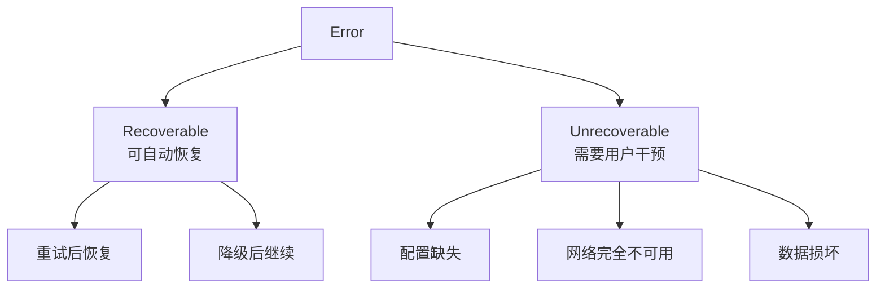
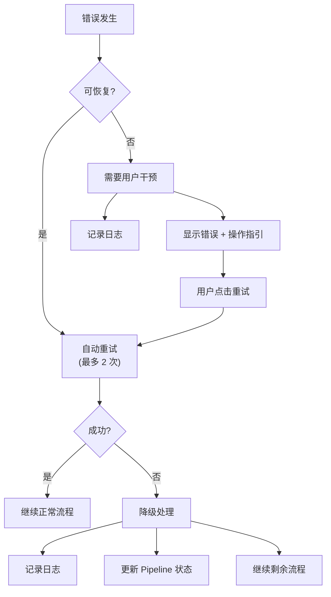

# Lettura 错误处理规范

> 定义 AI Pipeline、API 调用、前端交互中所有错误场景的处理策略和用户可见的反馈。

---

## 1. 错误分层



---

## 2. AI / Pipeline 错误

### 2.1 API Key 相关

| 场景 | 检测方式 | 处理 | 用户反馈 |
|------|---------|------|---------|
| 未配置 API Key | 启动时检查 config | 不启动 Pipeline | Today 页显示配置引导卡片 |
| API Key 无效 | API 返回 401 | 停止 Pipeline，标记 error | Toast: "API Key 无效，请检查配置" |
| API Key 额度用尽 | API 返回 429/402 | 停止 Pipeline | Toast: "API 额度不足" + "查看用量" 链接 |

### 2.2 API 调用错误

| 场景 | 检测方式 | 处理 | 用户反馈 |
|------|---------|------|---------|
| 网络超时 (>30s) | reqwest timeout | 重试 1 次，指数退避 | Pipeline 状态: "重试中..." |
| API 限流 (429) | HTTP status | 等待 Retry-After 头指定时间后重试 | Pipeline 状态: "等待 API 限额恢复" |
| 服务端错误 (5xx) | HTTP status | 重试 2 次，间隔 10s | Pipeline 状态: "API 暂时不可用" |
| 请求体过大 | API 返回 413 | 截断文章内容至 4000 tokens 后重试 | 无（自动处理） |
| 响应解析失败 | JSON parse error | 标记该文章 AI 失败，继续下一篇 | 无 |

### 2.3 Pipeline 执行错误

| 场景 | 检测方式 | 处理 | 用户反馈 |
|------|---------|------|---------|
| Pipeline 已在运行 | 检查 pipeline_runs 状态 | 拒绝新 Pipeline | Toast: "AI 分析正在运行中" |
| Embedding 批次失败 | batch 错误 | 跳过该批次，标记文章未处理 | Pipeline 进度: "部分文章处理失败" |
| 聚类异常 | 距离矩阵异常 | 回退到简单相似度匹配 | 无 |
| LLM 输出校验失败 | 字数/句数不符 | 重试 1 次，仍失败则降级 | 无 |
| Pipeline 全部失败 | pipeline_runs.status | 记录错误，保持上次结果 | "⚠ 分析失败" + 重试按钮 |

### 2.4 降级策略

```
Summary 生成失败 → summary = NULL，前端显示文章原标题
WIM 生成失败 → why_it_matters = summary 文本
Overview 生成失败 → "{count} 篇新文章，{signal_count} 条 Signal"
Signal 标题失败 → 使用聚类中最高分文章的标题
Topic 描述失败 → description = title
Embedding 全部失败 → 跳过聚类，按时间排序
```

---

## 3. Feed / Source 错误

### 3.1 Feed 抓取错误

| 场景 | 检测方式 | 处理 | 用户反馈 |
|------|---------|------|---------|
| RSS URL 404 | HTTP 404 | 标记 health_status='error' | Feed 侧显示 ⚠ 图标 |
| RSS 解析失败 | feed parser error | 标记 failure_reason | Feed 侧显示 "解析失败" |
| 超时 (>15s) | reqwest timeout | 标记 health_status='timeout' | Feed 侧显示 "超时" |
| SSL 证书错误 | TLS error | 标记 failure_reason | Feed 侧显示 "连接不安全" |
| 编码错误 | charset mismatch | 尝试 UTF-8、GBK、Latin-1 依次解码 | 无 |

### 3.2 Starter Pack 安装错误

| 场景 | 处理 | 用户反馈 |
|------|------|---------|
| Pack JSON 文件缺失 | 返回 SRC_NOT_FOUND | "Pack 不存在" |
| 部分 Feed 创建失败 | 跳过失败的，继续其他 | "⚠ 3 个源创建失败，已跳过" |
| 首次抓取全部失败 | 仍然标记安装成功 | "Pack 已安装，但源抓取失败，请检查网络" |

---

## 4. 前端错误处理

### 4.1 IPC 调用错误

```typescript
// 通用错误处理模式
async function safeInvoke<T>(command: string, args?: any): Promise<T | null> {
  try {
    return await invoke<T>(command, args);
  } catch (error) {
    const apiError = parseApiError(error);
    handleError(apiError);
    return null;
  }
}

function handleError(error: ApiError) {
  switch (error.code) {
    case 'AI_NO_API_KEY':
      showConfigGuide();
      break;
    case 'AI_API_ERROR':
      showToast(error.message, { type: 'error' });
      break;
    case 'PL_ALREADY_RUNNING':
      showToast('AI 分析正在运行中', { type: 'info' });
      break;
    default:
      showToast(error.message || '操作失败', { type: 'error' });
  }
}
```

### 4.2 页面级错误边界

| 页面 | 错误场景 | 降级显示 |
|------|---------|---------|
| Today | 信号加载失败 | "加载失败" + 重试按钮 |
| Today | Pipeline 运行中 | Skeleton + Pipeline 进度指示 |
| Today | 无 API Key | 配置引导卡片（替代信号列表） |
| Topic | Topic 列表为空 | 空状态文案 |
| Topic | 单个 Topic 加载失败 | "加载失败" + 返回列表 |
| Onboarding | Pack 安装失败 | 错误提示 + 重试/跳过选项 |

### 4.3 网络状态

```typescript
// 监听网络状态变化
window.addEventListener('offline', () => {
  showToast('网络已断开，部分功能不可用', { type: 'warning', duration: 0 });
});

window.addEventListener('online', () => {
  dismissToast('offline-warning');
  showToast('网络已恢复', { type: 'success' });
  refreshCurrentPage();
});
```

---

## 5. 日志规范

### 5.1 Rust 后端日志

```rust
// 使用 tauri::log
use tauri_plugin_log::LogTarget;

// Pipeline 关键节点日志
info!("pipeline_started", run_id = %run.id, run_type = %run.run_type);
info!("pipeline_batch_embedded", count = batch.len(), elapsed = ?duration);
warn!("pipeline_batch_failed", error = %e, articles_affected = ids.len());
error!("pipeline_fatal", error = %e, run_id = %run.id);

// API 调用日志
info!("ai_api_call", model = %model, tokens_in = input_tokens, tokens_out = output_tokens);
warn!("ai_api_retry", attempt = 2, error = %e, next_retry_in = ?delay);
error!("ai_api_fatal", model = %model, error = %e);
```

### 5.2 前端日志

```typescript
// 关键操作日志
console.info('[Today] Signals loaded:', signals.length);
console.warn('[Pipeline] Failed:', error);
console.error('[AI Config] Validation failed:', error);
```

---

## 6. 错误恢复流程


