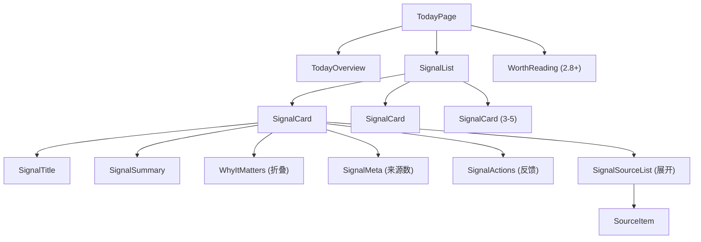

# Lettura 前端页面交互规格

> 定义 Today Intelligence、Topic 页面的组件结构、交互状态、视觉规范和边界情况。

---

## 1. Today Intelligence 页面

### 1.1 页面结构（线框）

```
┌──────────────────────────────────────────────┐
│  ← Today                    ⚙ Settings  🔄  │  ← 顶部导航栏（复用现有）
├──────────────────────────────────────────────┤
│                                              │
│  📡 今日概览                                  │  ← TodayOverview
│  "AI coding tools are moving toward          │
│   autonomous agent workflows..."             │
│                                              │
├──────────────────────────────────────────────┤
│                                              │
│  ┌──────────────────────────────────────┐    │
│  │ 🔵 Signal Card 1                     │    │  ← SignalCard
│  │                                      │    │
│  │ OpenAI Launches GPT-4o Mini          │    │  ← 标题
│  │ at 60% Lower Cost                    │    │
│  │                                      │    │
│  │ Smallest model matching GPT-4        │    │  ← 一句话结论 (summary)
│  │ quality at significantly lower cost   │    │
│  │                                      │    │
│  │ 💡 Why: This changes the economics   │    │  ← Why It Matters (折叠)
│  │ of embedding-heavy applications...    │    │
│  │                                      │    │
│  │ 📰 5 articles · 3 sources            │    │  ← 来源计数
│  │                                      │    │
│  │ 👍 有用  👎 不相关  📌 继续关注       │    │  ← 反馈按钮
│  │                                      │    │
│  │ ▼ 展开来源                            │    │  ← 来源展开按钮
│  └──────────────────────────────────────┘    │
│                                              │
│  ┌──────────────────────────────────────┐    │
│  │ 🔵 Signal Card 2 ...                 │    │
│  └──────────────────────────────────────┘    │
│                                              │
│  ... (3-5 张卡片)                            │
│                                              │
├──────────────────────────────────────────────┤
│  📰 Worth Reading (可选, 2.8+)               │  ← 精选原文区
│  - Article title 1 (来源名)                  │
│  - Article title 2 (来源名)                  │
└──────────────────────────────────────────────┘
```

### 1.2 组件树



### 1.3 组件状态规格

#### TodayOverview

| 状态 | 显示内容 | 视觉 |
|------|---------|------|
| loading | Skeleton 行（1 行，宽度 80%） | 灰色脉冲动画 |
| loaded | 一句话概览文本 | 正常文本，14px，次要色 |
| stale | 概览 + "30 分钟前更新" 标签 | 概览正常 + 灰色时间标签 |
| error | "无法生成概览" | 次要色文本 |
| no_data | "今天还没有新内容" | 次要色文本 + 空状态图标 |
| no_api_key | "请先配置 AI API Key" | 警告色 + 跳转 Settings 链接 |

#### SignalCard

| 状态 | 显示内容 | 视觉 |
|------|---------|------|
| loading | Skeleton 卡片（3 行） | 灰色脉冲动画 |
| loaded | 完整卡片 | 白色卡片，圆角 8px，轻微阴影 |
| expanded_sources | 卡片 + 展开的来源列表 | 来源列表向下滑出，带 transition |
| collapsed_wim | WIM 区域折叠，显示 "💡 Why" | 点击展开 |
| expanded_wim | WIM 区域展开 | 向下滑出，带 transition |
| feedback_given | 对应按钮高亮 | 按钮变为实心填充 |
| error | "Signal 加载失败" | 次要色文本 |

#### SignalSourceList（展开后）

```
┌────────────────────────────────────────┐
│ 📰 来源文章                             │
│                                        │
│ • OpenAI Blog          2h ago          │  ← SourceItem
│   "GPT-4o mini: our most              │
│    cost-efficient model..."            │
│                                        │
│ • The Verge            3h ago          │
│   "OpenAI releases smaller,            │
│    cheaper AI model..."                │
│                                        │
│ • TechCrunch           4h ago          │
│   "OpenAI makes GPT-4o mini..."        │
│                                        │
│ 显示全部 5 篇 ▼                         │  ← 加载更多
└────────────────────────────────────────┘
```

### 1.4 交互行为

| 操作 | 触发 | 行为 |
|------|------|------|
| 点击 SignalCard 标题 | onClick | 展开来源列表（toggle） |
| 点击 "💡 Why" | onClick | 展开/折叠 Why It Matters |
| 点击 "有用" | onClick | 调用 submit_feedback("useful")，按钮高亮，其他按钮禁用 |
| 点击 "不相关" | onClick | 调用 submit_feedback("not_relevant")，按钮高亮 |
| 点击 "继续关注" | onClick | 调用 submit_feedback("follow_topic")，按钮高亮 + toast "已加入关注" |
| 点击来源文章 | onClick | 打开原文阅读器（复用现有 ArticleReader） |
| 下拉刷新 | onPullDown | 触发 get_today_signals 重新加载 |
| 点击概览旁 "🔄" | onClick | 手动触发 Pipeline（仅 dev 模式） |

### 1.5 动画规范

| 动画 | 时长 | 缓动 |
|------|------|------|
| SignalCard 加载入场 | 200ms | ease-out，交错 50ms |
| WIM 展开/折叠 | 200ms | ease-in-out |
| 来源列表展开/折叠 | 300ms | ease-in-out |
| 反馈按钮状态变化 | 150ms | ease |
| Skeleton 脉冲 | 1.5s loop | ease-in-out |

---

## 2. Topic 页面（2.9+）

### 2.1 页面结构

```
┌──────────────────────────────────────────────┐
│  ← Topics                   ⚙ Settings       │
├──────────────────────────────────────────────┤
│                                              │
│  ┌──────────────────────────────────────┐    │
│  │ 🧩 AI Coding Tools                   │    │  ← TopicCard
│  │                                      │    │
│  │ AI-powered developer tools that      │    │  ← 描述
│  │ assist with coding tasks...          │    │
│  │                                      │    │
│  │ 12 articles · 7 sources              │    │  ← 统计
│  │ Last updated: 2h ago                 │    │
│  │                                      │    │
│  │ 📌 已关注                             │    │  ← 跟踪状态
│  └──────────────────────────────────────┘    │
│                                              │
│  ... (更多 Topic)                            │
│                                              │
└──────────────────────────────────────────────┘
```

### 2.2 Topic 详情页

```
┌──────────────────────────────────────────────┐
│  ← AI Coding Tools          📌 取消关注       │
├──────────────────────────────────────────────┤
│                                              │
│  📝 Topic 描述                               │
│  "AI-powered developer tools that assist     │
│   with or autonomously execute coding        │
│   tasks..."                                  │
│                                              │
│  📊 近期变化                                  │
│  "The shift from autocomplete to             │
│   autonomous agents..."                      │
│                                              │
├──────────────────────────────────────────────┤
│  📰 相关文章                                  │
│                                              │
│  ┌──────────────────────────────────────┐    │
│  │ Copilot Workspace adds autonomous    │    │  ← TopicArticle
│  │ task execution         GitHub Blog    │    │
│  │ 2h ago                               │    │
│  └──────────────────────────────────────┘    │
│                                              │
│  ... (更多文章)                              │
└──────────────────────────────────────────────┘
```

### 2.3 Topic 组件状态

| 状态 | 显示 | 视觉 |
|------|------|------|
| loading | Skeleton 列表 | 灰色脉冲 |
| loaded | TopicCard 列表 | 正常 |
| empty | "还没有形成 Topic" | 次要色 + 空状态图标 |
| following | "📌 已关注" 标签 | 实心图标 |
| not_following | "关注" 按钮 | 轮廓按钮 |

---

## 3. 全局组件

### 3.1 Pipeline 状态指示器

显示在 Today 页面右上角：

```
Pipeline 状态：
├── idle     → 不显示
├── running  → 旋转图标 + "分析中..." + 点击展开进度
├── done     → "✓ 已更新" 闪烁 3s 后消失
└── error    → "⚠ 分析失败" + 点击查看错误 + 重试按钮
```

### 3.2 API Key 配置引导

当检测到未配置 API Key 时：

```
┌──────────────────────────────────────────────┐
│  ⚠️ AI 功能需要配置 API Key                    │
│                                              │
│  Lettura 的 Today Intelligence 功能需要       │
│  OpenAI API Key 才能工作。                    │
│                                              │
│  [配置 API Key]  [了解 BYOK 模式]             │
│                                              │
│  💡 你的数据不会被发送到第三方训练模型           │
└──────────────────────────────────────────────┘
```

### 3.3 空状态规范

| 场景 | 显示文案 | 操作按钮 |
|------|---------|---------|
| Today 无数据 | "今天还没有新文章。添加信息源后，AI 将为你筛选最重要的内容。" | "添加信息源" / "安装 Starter Pack" |
| Pipeline 未运行 | "AI 分析尚未运行。点击运行开始生成 Today Intelligence。" | "开始分析" |
| Topic 列表为空 | "当相关文章积累足够多后，Topic 会自动生成。" | 无 |
| 所有 Signal 已读 | "今天的 Signals 都已查看。" | 无 |

---

## 4. 响应式布局

### 4.1 宽度断点

| 宽度 | 布局 | SignalCard |
|------|------|-----------|
| < 640px | 单列 | 全宽 |
| 640-1024px | 单列 + 侧边栏 | 主内容区 |
| > 1024px | 双列可选 | 双列网格或单列宽卡 |

### 4.2 侧边栏与 Today 的关系

```
桌面布局 (>1024px):
┌────────────┬─────────────────────────────┐
│            │                             │
│  侧边栏    │  Today Intelligence         │
│  (现有)    │  (主内容区)                  │
│            │                             │
│  Feeds     │  TodayOverview              │
│  Today ★   │  SignalCard × 5             │
│  Starred   │  WorthReading               │
│  Topics    │                             │
│            │                             │
└────────────┴─────────────────────────────┘

★ Today 提升为侧边栏第一项（在 Feeds 之上或作为独立分组）
```

---

## 5. 国际化

### 5.1 新增 i18n Key

```json
// en.json 新增
{
  "today": {
    "title": "Today",
    "overview": "Today's Overview",
    "signals": "Key Signals",
    "why_it_matters": "Why It Matters",
    "sources": "sources",
    "articles": "articles",
    "feedback": {
      "useful": "Useful",
      "not_relevant": "Not Relevant",
      "follow": "Follow Topic"
    },
    "empty": {
      "no_articles": "No new articles today.",
      "no_api_key": "Please configure your AI API Key.",
      "pipeline_not_run": "AI analysis hasn't run yet."
    },
    "pipeline": {
      "running": "Analyzing...",
      "done": "Updated",
      "error": "Analysis failed"
    }
  },
  "topics": {
    "title": "Topics",
    "follow": "Follow",
    "following": "Following",
    "unfollow": "Unfollow",
    "empty": "Topics will appear as related articles accumulate."
  },
  "onboarding": {
    "welcome": "Welcome to Lettura",
    "select_packs": "Choose your interests",
    "installing": "Setting up your feeds...",
    "done": "All set!"
  }
}
```

```json
// zh.json 新增
{
  "today": {
    "title": "今天",
    "overview": "今日概览",
    "signals": "关键信号",
    "why_it_matters": "为什么重要",
    "sources": "个来源",
    "articles": "篇文章",
    "feedback": {
      "useful": "有用",
      "not_relevant": "不相关",
      "follow": "继续关注"
    },
    "empty": {
      "no_articles": "今天还没有新文章。",
      "no_api_key": "请先配置 AI API Key。",
      "pipeline_not_run": "AI 分析尚未运行。"
    },
    "pipeline": {
      "running": "分析中...",
      "done": "已更新",
      "error": "分析失败"
    }
  },
  "topics": {
    "title": "主题",
    "follow": "关注",
    "following": "已关注",
    "unfollow": "取消关注",
    "empty": "相关文章积累后，主题会自动出现。"
  },
  "onboarding": {
    "welcome": "欢迎使用 Lettura",
    "select_packs": "选择你感兴趣的领域",
    "installing": "正在设置你的信息源...",
    "done": "准备就绪！"
  }
}
```

---

## 6. 新增路由

| 路由 | 组件 | 版本 |
|------|------|------|
| `/local/today` | TodayPage（重构） | 2.2 |
| `/local/topics` | TopicListPage | 2.10 |
| `/local/topics/:uuid` | TopicDetailPage | 2.10 |
| (dialog) | OnboardingDialog | 2.1 |
| (dialog) | AIConfigDialog (Settings tab) | 2.3 |

### 6.1 路由变更

```typescript
// config.ts 新增
export const ROUTES = {
  // ...existing routes...
  TODAY: '/local/today',          // 现有，重构内容
  TOPICS: '/local/topics',        // 新增
  TOPIC_DETAIL: '/local/topics/:uuid', // 新增
};
```

`/local/today` 从共享 `ArticleContainer` 改为独立的 `TodayPage` 组件。
