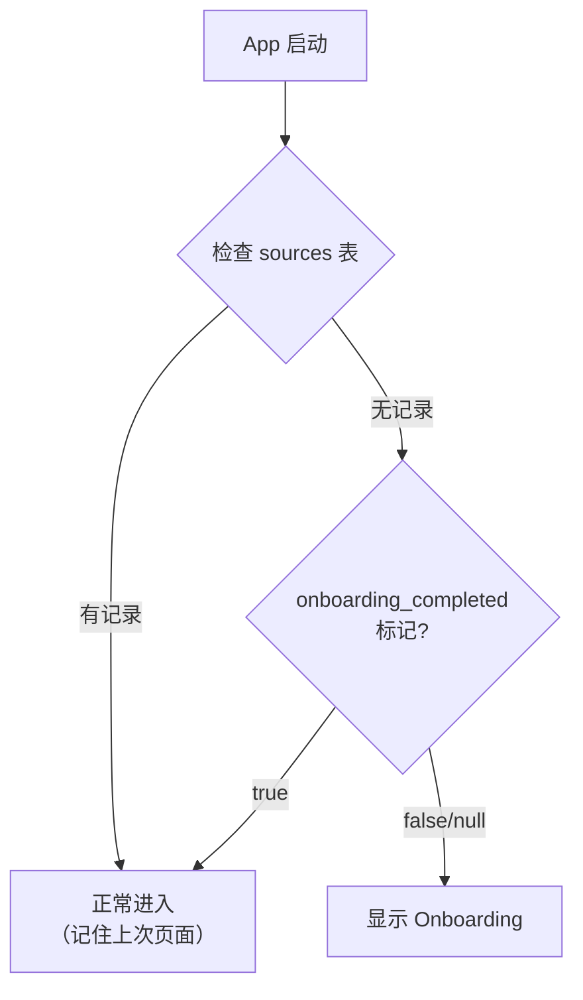

# Lettura Onboarding 交互流程规格

> 定义首次启动、Starter Pack 选择、安装进度、安装后引导的完整交互流程，包括所有边界情况。

---

## 1. 触发条件



实现方式：在 `lettura.toml` 中新增 `app.onboarding_completed = true/false` 标记，与现有 proxy、port 等配置同级别管理。Rust 端通过 `core/config.rs` 现有的 TOML 读取逻辑获取该值。

---

## 2. Onboarding 流程步骤

### Step 1: 欢迎页

```
┌──────────────────────────────────────────────┐
│                                              │
│           🗞️ Lettura                         │
│                                              │
│     Your Personal Intelligence Feed          │
│                                              │
│  帮你从海量信息中发现真正重要的信号            │
│                                              │
│  ──────────────────────────────────────       │
│                                              │
│  Lettura 的工作方式:                          │
│                                              │
│  1️⃣ 选择你关注的信息领域                      │
│  2️⃣ AI 自动分析每天最重要的内容               │
│  3️⃣ 只看结论，不用刷几百篇文章                │
│                                              │
│                                              │
│          [开始设置 →]                         │
│                                              │
│  已有 RSS 订阅？[导入 OPML]                   │
│                                              │
└──────────────────────────────────────────────┘
```

**行为：**
- 点击 "开始设置" → 进入 Step 2
- 点击 "导入 OPML" → 触发文件选择器，导入后跳过 Step 2-3，直接进入 Today
- 不允许跳过 Onboarding（必须至少安装 1 个 Pack 或导入 OPML）

### Step 2: 选择兴趣 Pack

```
┌──────────────────────────────────────────────┐
│  ← 返回        选择你关注的领域       继续 →  │
├──────────────────────────────────────────────┤
│                                              │
│  ┌─────────────┐  ┌─────────────┐            │
│  │ 🤖 AI       │  │ 💻 开发者   │            │
│  │ 18 sources  │  │ 16 sources  │            │
│  │ ✓ 已选      │  │             │            │
│  └─────────────┘  └─────────────┘            │
│                                              │
│  ┌─────────────┐  ┌─────────────┐            │
│  │ 🚀 创业     │  │ 📦 产品     │            │
│  │ 15 sources  │  │ 14 sources  │            │
│  │ ✓ 已选      │  │             │            │
│  └─────────────┘  └─────────────┘            │
│                                              │
│  ┌─────────────┐  ┌─────────────┐            │
│  │ 🎨 设计     │  │ 🔬 科学     │            │
│  │ 13 sources  │  │ 12 sources  │            │
│  └─────────────┘  └─────────────┘            │
│                                              │
│  ┌─────────────┐  ┌─────────────┐            │
│  │ 💼 商业     │  │ 📰 科技新闻 │            │
│  │ 14 sources  │  │ 16 sources  │            │
│  └─────────────┘  └─────────────┘            │
│                                              │
│  已选 2 个 Pack · 共 33 个信息源              │
│                                              │
└──────────────────────────────────────────────┘
```

**行为：**
- 卡片点击 toggle 选中状态
- 建议选择 2-3 个 Pack（不强制，但至少选 1 个）
- 选 0 个时 "继续" 按钮禁用
- 底部显示已选统计
- 点击 Pack 卡片 → 展开显示前 5 个源名称（预览）
- 点击 "继续" → 弹出确认摘要 → 进入 Step 3

**确认摘要弹窗：**
```
┌────────────────────────────────────┐
│  确认安装                           │
│                                    │
│  将安装以下 Pack:                   │
│  • AI & Machine Learning (18源)    │
│  • 创业 (15源)                     │
│                                    │
│  共 33 个信息源                     │
│  安装后可随时在设置中添加/删除       │
│                                    │
│  [返回]  [确认安装]                 │
└────────────────────────────────────┘
```

### Step 3: 安装进度

```
┌──────────────────────────────────────────────┐
│                                              │
│           ⏳ 正在设置你的信息源                │
│                                              │
│  ━━━━━━━━━━━━━━━━━━━━━━━━━━━ 60%            │
│                                              │
│  ✅ AI & Machine Learning                    │
│     18/18 源已抓取 (42 篇文章)               │
│                                              │
│  ⏳ 创业                                     │
│     12/15 源已抓取 (28 篇文章)               │
│                                              │
│  ⏭ TechCrunch Startups...                   │
│     正在抓取...                               │
│                                              │
│  💡 提示：AI 正在分析这些文章...              │
│     完成后你将看到今天最重要的内容             │
│                                              │
└──────────────────────────────────────────────┘
```

**行为：**
- 监听 `feed:sync_progress` 事件更新进度
- 每个 Pack 显示抓取状态（完成/进行中/失败）
- 进度条 = completed_feeds / total_feeds
- 底部提示文字 5 秒轮换：
  - "AI 正在分析这些文章..."
  - "完成后你将看到今天最重要的内容"
  - "Lettura 不会把你的数据发送给第三方"
- 所有源抓取完成 → 自动进入 Step 4

### Step 4: 完成

```
┌──────────────────────────────────────────────┐
│                                              │
│           ✅ 设置完成！                       │
│                                              │
│  已安装 33 个信息源                           │
│  已抓取 70 篇文章                             │
│  AI 已生成 3 条今日 Signal                    │
│                                              │
│  ──────────────────────────────────────       │
│                                              │
│  💡 小贴士:                                   │
│  • 每天打开 Today 就能看到最重要的内容        │
│  • 对结果给出反馈，AI 会越来越懂你            │
│  • 随时在 Settings 中配置 AI 和信息源         │
│                                              │
│                                              │
│          [进入 Today →]                       │
│                                              │
└──────────────────────────────────────────────┘
```

**行为：**
- 点击 "进入 Today" → 导航到 `/local/today`
- 设置 `lettura.toml` 中 `[app]` 下的 `onboarding_completed = true`
- 如果 Pipeline 还没完成 → Today 页显示 Pipeline 状态指示器

---

## 3. 边界情况

### 3.1 网络失败

| 场景 | 行为 |
|------|------|
| Pack 安装时网络断开 | 显示错误提示 "网络连接失败"，提供 "重试" 和 "跳过失败的源" 选项 |
| 部分源抓取失败 | 标记失败源但继续其他源，进度页显示 "⚠ 3 个源抓取失败" |
| 所有源都失败 | 显示 "安装遇到问题"，提供 "重试全部" 和 "稍后再试" |
| API Key 未配置 | Step 3 中正常抓取文章，但不触发 Pipeline，完成后提示 "配置 AI API Key 以启用 Today Intelligence" |

### 3.2 用户退出

| 场景 | 行为 |
|------|------|
| Step 1 关闭窗口 | 隐藏到托盘（现有行为），下次打开回到 Step 1 |
| Step 2 关闭窗口 | 同上 |
| Step 3 关闭窗口 | 后台继续安装，下次打开检测到有 feeds 则跳过 Onboarding |
| 安装中关闭窗口 | 后台继续，下次打开直接进入 Today |

### 3.3 重复安装

| 场景 | 行为 |
|------|------|
| 用户删除所有 feeds 后重启 | 不再触发 Onboarding（`lettura.toml` 中 `onboarding_completed = true`），Today 显示空状态 + "安装 Starter Pack" 按钮 |
| 用户在 Settings 重新打开 Onboarding | 允许通过 Settings 入口重新进入 Pack 选择，但不清除已有 feeds |

### 3.4 OPML 导入

```
Step 1 点击 "导入 OPML"
    ↓
文件选择器（.xml / .opml）
    ↓
解析 OPML → 提取 feed URL 列表
    ↓
显示导入预览: "发现 42 个订阅源"
    ↓
确认导入 → 创建 feeds + sources (source_type='opml_import')
    ↓
触发首次抓取（同 Step 3 的进度展示）
    ↓
进入 Today
```

如果 OPML 解析失败 → 显示 "无法解析 OPML 文件，请检查文件格式" + "重试"。

---

## 4. 实现细节

### 4.1 状态管理

```typescript
// stores/onboardingSlice.ts
interface OnboardingState {
  step: 1 | 2 | 3 | 4;
  packs: StarterPack[];
  selectedPackIds: string[];
  installStatus: {
    total_feeds: number;
    completed_feeds: number;
    failed_feeds: number;
    articles_fetched: number;
  };
  isInstalling: boolean;
}
```

### 4.2 事件监听

```typescript
// Onboarding Step 3 中的事件处理
listen('feed:sync_progress', (event) => {
  const { completed_feeds, total_feeds, articles_fetched } = event.payload;
  store.setState({
    installStatus: { total_feeds, completed_feeds, articles_fetched, failed_feeds: ... }
  });
});
```

### 4.3 路由守卫

```typescript
// 在 App.tsx 或路由配置中
const needsOnboarding = !userConfig.onboarding_completed && feeds.length === 0;
// onboarding_completed 从 Rust 端读取 lettura.toml 中 [app].onboarding_completed
if (needsOnboarding) {
  // 重定向到 Onboarding dialog 或页面
}
```
