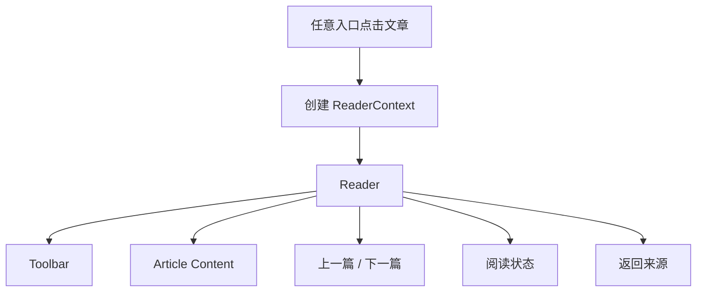
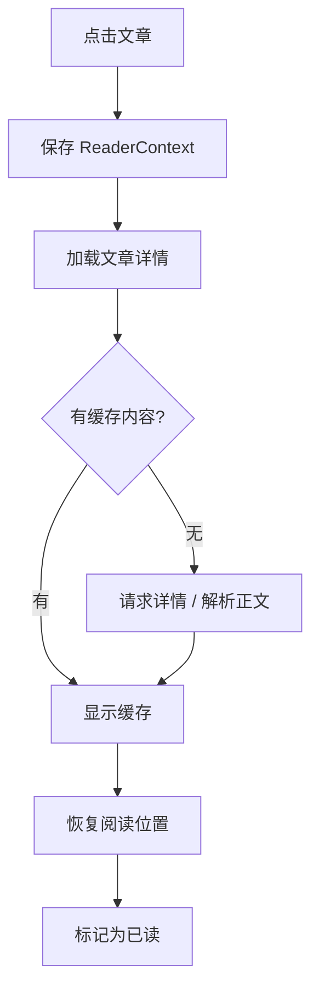
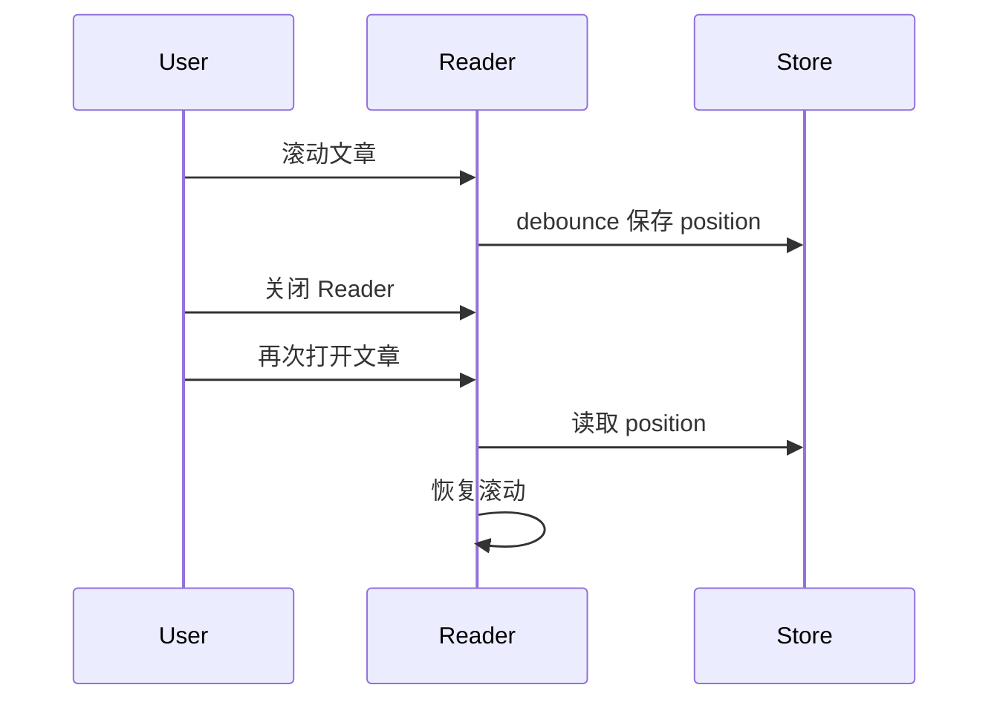

# Article Reader 交互规格

> Reader 是深读层，可从 Today、Topics、Feeds、Search、Starred 打开，必须保留返回上下文。

## 1. 信息架构



## 2. ReaderContext

```ts
interface ReaderContext {
  source: "today" | "topic" | "feed" | "search" | "starred";
  sourceRoute: string;
  articleIds: string[];
  activeArticleId: string;
  signalId?: string;
  topicId?: string;
  query?: string;
}
```

## 3. 打开流程



## 4. Toolbar 操作

| 操作 | 行为 |
|------|------|
| 返回 | 回到 ReaderContext.sourceRoute |
| 星标 | toggle starred |
| 稍后读 | toggle readLater |
| 已读/未读 | toggle read state |
| 打开原文 | 系统浏览器打开 URL |
| 复制链接 | 复制 URL |
| 阅读设置 | 打开阅读设置 |
| 更多 | 分享/导出/删除缓存 |

## 5. 上一篇 / 下一篇

规则：

- 在 ReaderContext.articleIds 中切换。
- 第一篇禁用上一篇。
- 最后一篇禁用下一篇。
- 切换时保存当前阅读位置。

## 6. 阅读状态

记录：

- read/unread
- starred
- readLater
- readProgress
- scrollPosition
- lastReadAt

### 6.1 阅读位置恢复



## 7. 来源上下文

| 来源 | Reader 辅助展示 |
|------|----------------|
| Today | 同一 Signal 的其他来源 |
| Topic | 同一 Topic 的推荐深读 |
| Feed | 当前 Feed 文章队列 |
| Search | 命中片段高亮 |
| Starred | 笔记、标签、阅读进度 |

## 8. 错误处理

| 错误 | UI |
|------|----|
| 文章详情加载失败 | 重试 / 打开原文 |
| 解析正文失败 | 显示标题摘要 + 打开原文 |
| 保存状态失败 | Toast + 回滚按钮 |
| 原文链接缺失 | 禁用打开原文 |

## 9. 接口建议

| 功能 | 接口 |
|------|------|
| 详情 | `getArticleDetail(articleId)` |
| 已读 | `updateArticleReadState(articleId, read)` |
| 收藏 | `updateStarred(articleId, starred)` |
| 稍后读 | `updateReadLater(articleId, readLater)` |
| 阅读位置 | `saveReadPosition(articleId, position)` |
| 笔记 | `saveArticleNote(articleId, note)` |

## 10. 验收清单

- [ ] 从所有入口可打开 Reader。
- [ ] 返回上下文正确。
- [ ] 上一篇/下一篇按上下文切换。
- [ ] 阅读位置可恢复。
- [ ] 星标、稍后读、已读可保存。
- [ ] Search 命中可高亮。
- [ ] 加载失败有重试和打开原文。

