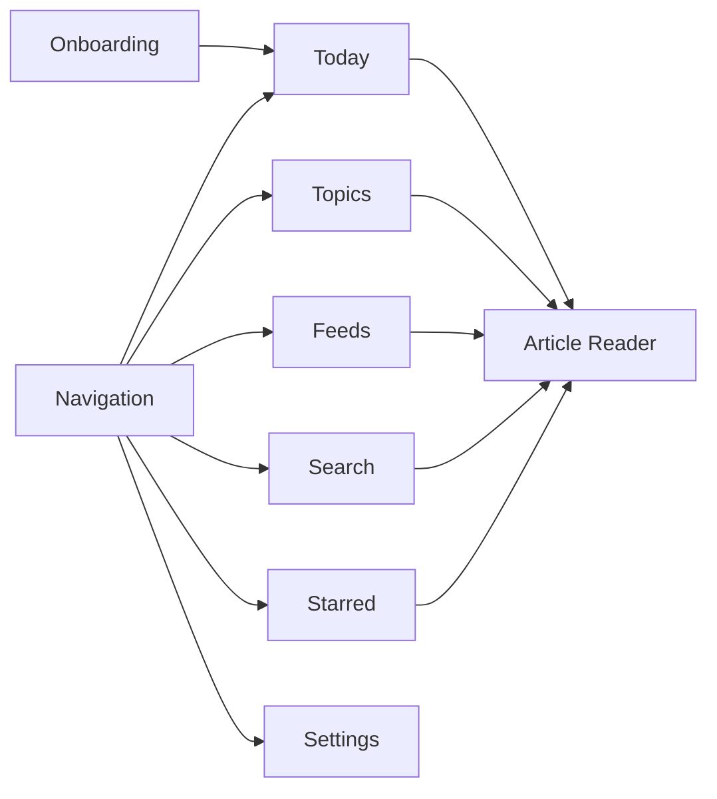

# 核心模块交互规格索引

> 本文件只保留模块地图和文档索引，避免与页面级交互文档重复。具体功能、流程图、接口和验收项以各页面级文档为准。

---

## 1. 模块地图

---

## 2. 页面级文档

| 模块 | 文档 |
|------|------|
| Navigation | `prd/ui/navigation-interaction-spec.md` |
| Today | `prd/ui/today-interaction-spec.md` |
| Topics | `prd/ui/topics-interaction-spec.md` |
| Feeds | `prd/ui/feeds-interaction-spec.md` |
| Search | `prd/ui/search-interaction-spec.md` |
| Starred | `prd/ui/starred-interaction-spec.md` |
| Article Reader | `prd/ui/article-reader-interaction-spec.md` |
| Onboarding | `prd/ui/onboarding-interaction-spec.md` |
| Settings | `prd/ui/settings-interaction-spec.md` |

---

## 3. 以 Mockup 为准的布局结论

当前 mockup 中的页面布局如下：

| 页面 | 布局 |
|------|------|
| Today | Rail + Sidebar + Main + Right Panel |
| Today + Reading | Rail + Sidebar + Signal List + Reader |
| Topics | Rail + Main |
| Topic Detail | Rail + Main |
| Feeds | Rail + Sidebar + Main |
| Search | Rail + Sidebar + Main + Right Panel |
| Starred | Rail + Sidebar + Main + Right Panel |
| Settings | Rail + Main |
| Article (Feeds) | Rail + Article List + Reader |

若其他 PRD 与上表冲突，以上表为准。

