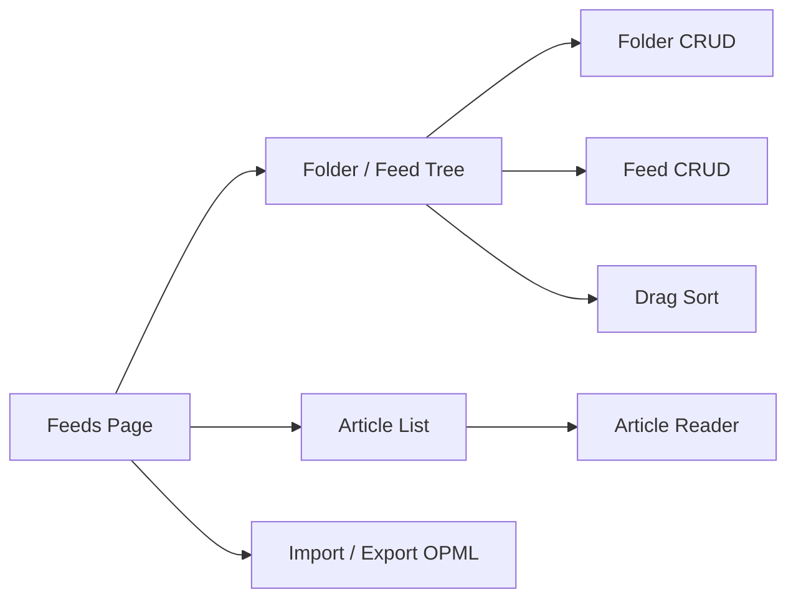
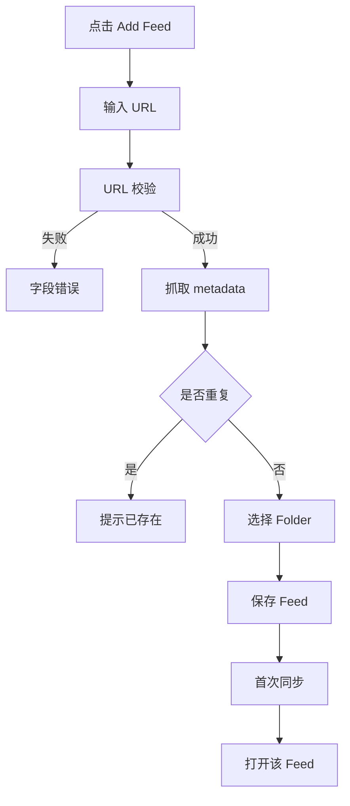
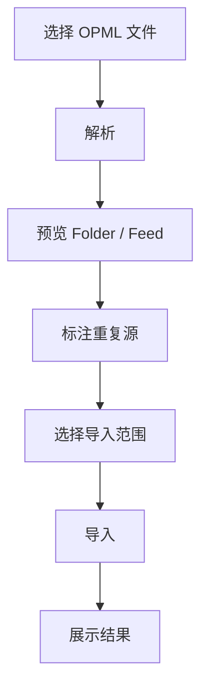

# Feeds 交互规格

> Feeds 给控制，不给首页。本文覆盖 Feed / Folder 管理、文章列表、OPML、拖拽与健康状态。

## 1. 信息架构

## 2. Feed Tree

Folder 行：

- 名称
- 未读总数
- 展开/折叠状态
- 右键菜单

Feed 行：

- 名称
- 健康状态
- 未读数
- 最近同步时间
- Intelligence 轻状态预留

## 3. 基本交互

| 操作 | 行为 |
|------|------|
| 点击 Folder | 展开/折叠 |
| 点击 Feed | Main 显示该源文章 |
| 右键 Folder | 重命名 / 新建 Feed / 删除 |
| 右键 Feed | 编辑 / 刷新 / 标记已读 / 删除 |
| 拖拽 Feed | 排序或移动 Folder |
| 拖拽 Folder | 调整 Folder 顺序 |
| Add Feed | 打开添加对话框 |

## 4. 添加 Feed 流程

## 5. 编辑 Feed

字段：

- title
- feedUrl
- siteUrl
- folderId

保存规则：

- URL 变更后需要重新验证。
- 保存成功后刷新 Tree。
- 保存失败保留输入。

## 6. 删除 Feed / Folder

Feed 删除必须确认：

- 删除源但保留历史文章。
- 删除源并删除历史文章。

Folder 删除必须确认：

- 删除空 Folder。
- 非空 Folder：移动 feeds 到 Unfiled 或一并删除。

## 7. OPML

导入流程：

导出：

- 导出当前 Folder + Feed tree。
- 文件名：`lettura-subscriptions-YYYY-MM-DD.opml`。

## 8. Feed Article List

| 操作 | 行为 |
|------|------|
| 点击文章 | 打开 Reader |
| 标记已读/未读 | 更新 unread count |
| 星标 | 加入 Starred |
| 稍后读 | 加入 Read Later |
| 全部已读 | 当前 Feed 未读清零 |
| 筛选未读 | 只看 unread |

## 9. 健康状态

| 状态 | 条件 |
|------|------|
| healthy | 最近 5 次至少 4 次成功 |
| warning | 最近 5 次失败 2-3 次或慢 |
| broken | 最近 5 次失败 4 次以上 |
| disabled | 用户停用 |

## 10. 接口建议

| 功能 | 接口 |
|------|------|
| Tree | `getFeedTree()` |
| Add | `addFeed(url, folderId)` |
| Edit | `updateFeed(feedId, payload)` |
| Delete | `deleteFeed(feedId, options)` |
| Sync | `syncFeed(feedId)` |
| Folder | `createFolder/updateFolder/deleteFolder` |
| Sort | `updateFeedOrder(payload)` |
| OPML | `importOpml/exportOpml` |

## 11. 验收清单

- [ ] Folder 展开/折叠状态持久化。
- [ ] Feed CRUD 完整。
- [ ] 删除有二次确认。
- [ ] 拖拽排序持久化。
- [ ] OPML 导入有预览和重复检测。
- [ ] Feed 文章点击进入 Reader。
- [ ] 健康状态可见。

