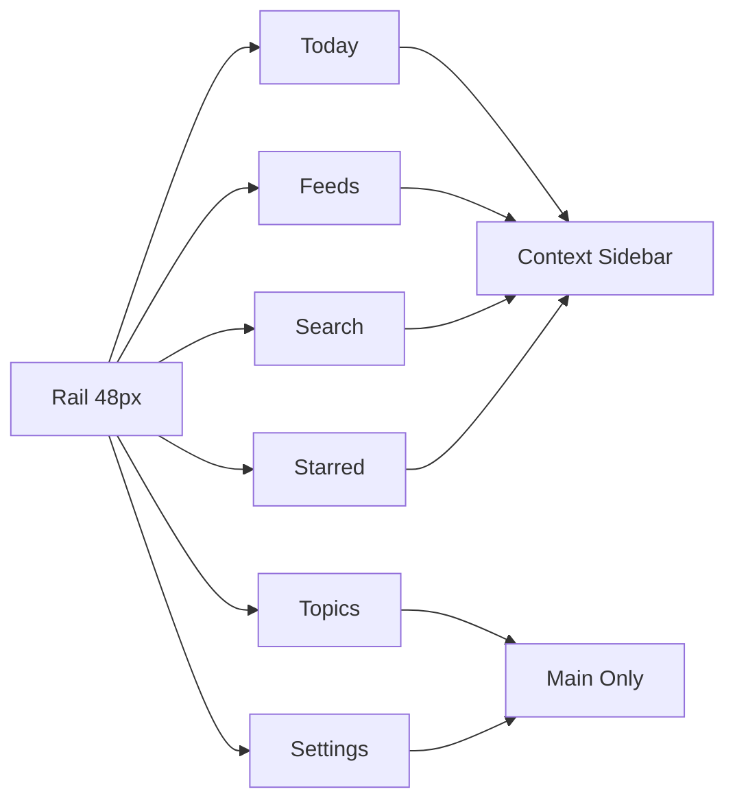
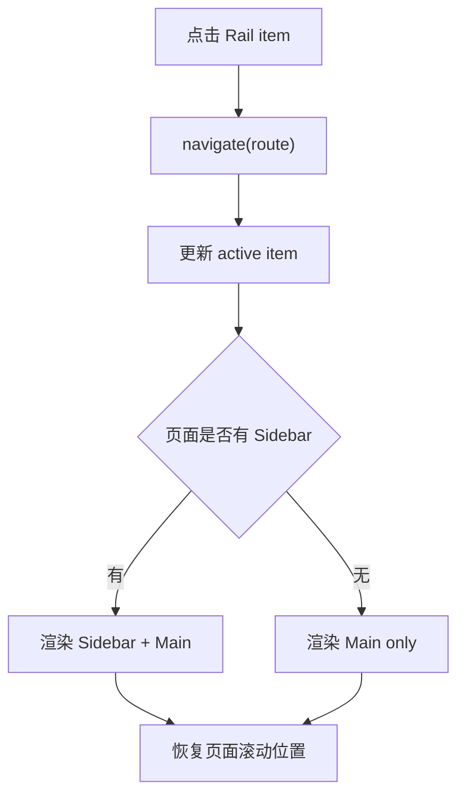

# Navigation 交互规格

> 覆盖全局 Rail、Sidebar、页面切换、返回上下文与跨页面 active 状态。

## 1. 定位

Navigation 是 Lettura 的认知路径入口：

```text
Today → Topics → Feeds → Search → Starred → Settings
```

Rail 负责一级导航；Sidebar 只在需要上下文的页面出现。以当前 mockup 为准：Topics、Topic Detail、Settings 不使用 Sidebar。

## 2. 结构图



## 3. Rail 项

| 名称 | 路由 | active 判定 |
|------|------|-------------|
| Today | `/today` | Today 与从 Today 打开的阅读态 |
| Topics | `/topics` | Topic 列表、详情、从 Topic 打开的阅读态 |
| Feeds | `/feeds` | Feeds 与从 Feed 打开的阅读态 |
| Search | `/search` | Search 页面 |
| Starred | `/starred` | Starred 与从 Starred 打开的阅读态 |
| Settings | `/settings` | Settings 页面 |

## 4. 页面切换流程



## 5. Sidebar 规则

| 页面 | Sidebar 内容 |
|------|--------------|
| Today | Today Focus、Tracked Topics、分析状态 |
| Topics | 无 |
| Topic Detail | 无 |
| Feeds | Folder / Feed tree |
| Search | 最近搜索、筛选、相关 Topic |
| Starred | 收藏夹、标签、阅读队列 |
| Settings | 无 |

Sidebar 只展示上下文，不做重复一级导航。

## 6. 返回上下文

Reader 必须保存打开来源：

```ts
type ReaderSource = "today" | "topic" | "feed" | "search" | "starred";

interface ReaderContext {
  source: ReaderSource;
  sourceRoute: string;
  articleIds: string[];
  activeArticleId: string;
}
```

返回规则：

- 从 Today source 打开：返回 Today 且定位 Signal。
- 从 Topic 打开：返回 Topic Detail。
- 从 Feed 打开：返回 Feed article list。
- 从 Search 打开：返回搜索结果并保留 query。
- 从 Starred 打开：返回 Starred 当前筛选。

## 7. 键盘与可访问性

- Rail item 是 `button` 或 `a`，有 `aria-label`。
- 当前项设置 `aria-current="page"`。
- Tooltip 不作为唯一可访问名称。
- 支持 Tab 顺序：Rail → Sidebar（若存在）→ Main。
- `/` 在 Search 页面聚焦搜索框。
- `Esc` 关闭弹窗、菜单、抽屉。

## 8. 验收清单

- [ ] 6 个 Rail item 均可跳转。
- [ ] 详情页和阅读态 active 归属正确。
- [ ] Settings 无 Sidebar。
- [ ] Topics / Topic Detail 无 Sidebar。
- [ ] Sidebar 内容随页面变化。
- [ ] 返回上下文不丢失。
- [ ] 切换页面恢复滚动位置。
- [ ] Rail 支持键盘和屏幕阅读器。
