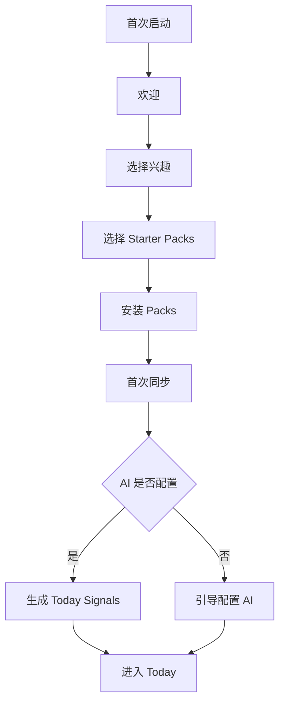
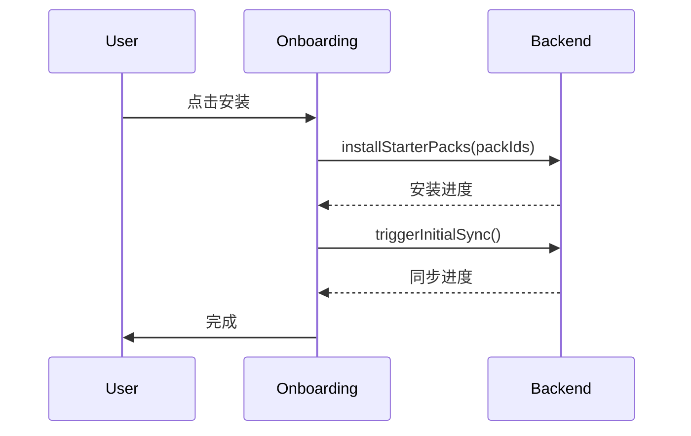

# Onboarding 交互规格

> Onboarding 的目标是让新用户尽快拥有高质量来源，并进入 Today 的判断工作流。

## 1. 信息架构



## 2. 触发条件

显示 Onboarding 当：

- 首次启动。
- 无任何 Feed。
- 用户主动从空状态点击 `开始设置`。

不显示当：

- 已完成 onboarding。
- 已有 Feed 且用户跳过。

## 3. 步骤

### 3.1 Welcome

内容：

- Lettura 定位：Daily Intelligence Reader。
- 简短说明：选择来源 → 同步 → 生成 Today。

操作：

- `开始`
- `跳过`

### 3.2 选择兴趣

兴趣：

- AI
- Developer
- Startup
- Product
- Design
- Business
- Science

规则：

- 至少选择 1 个。
- 推荐默认选 2-3 个。

### 3.3 Starter Packs

Pack 卡片：

- 名称
- 描述
- 来源数量
- 示例来源
- 质量说明

操作：

- 选择 / 取消选择
- 预览来源

### 3.4 安装

流程：



### 3.5 AI 引导

若 AI 未配置：

- 显示 `现在配置` 和 `稍后再说`。
- 现在配置：打开 Settings / AI。
- 稍后：进入 Today，但 Today 显示 AI 配置 CTA。

## 4. 进度状态

| 状态 | UI |
|------|----|
| 安装 Pack | progress + 当前 Pack |
| 同步 Feed | 已同步 x/y |
| 分析文章 | 正在生成 Today |
| 失败 | 重试 / 跳过 |

## 5. 空状态复用

各页面无数据时可引导回 Onboarding 子流程：

| 页面 | CTA |
|------|-----|
| Today 无源 | 选择 Starter Pack |
| Feeds 为空 | Add Feed / Import OPML / Starter Pack |
| Topics 为空 | 先生成 Today Signals |
| Search 未输入 | 推荐搜索 |
| Starred 为空 | 从文章中收藏 |

## 6. 数据记录

```ts
interface OnboardingState {
  completed: boolean;
  skipped: boolean;
  selectedInterests: string[];
  installedPackIds: string[];
  completedAt?: string;
}
```

## 7. 接口建议

| 功能 | 接口 |
|------|------|
| Pack 列表 | `getStarterPacks()` |
| Pack 预览 | `previewStarterPack(packId)` |
| 安装 | `installStarterPacks(packIds)` |
| 首次同步 | `triggerInitialSync()` |
| 保存状态 | `saveOnboardingState(state)` |

## 8. 验收清单

- [ ] 首次启动自动进入 Onboarding。
- [ ] 兴趣至少选择 1 个。
- [ ] Pack 可预览和安装。
- [ ] 安装和同步有进度。
- [ ] 失败可重试或跳过。
- [ ] AI 未配置可跳 Settings。
- [ ] 完成后进入 Today。

