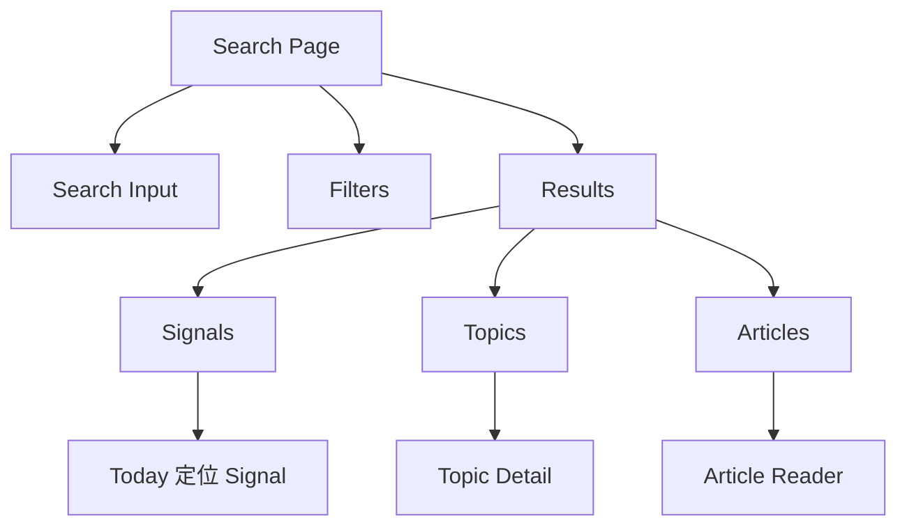
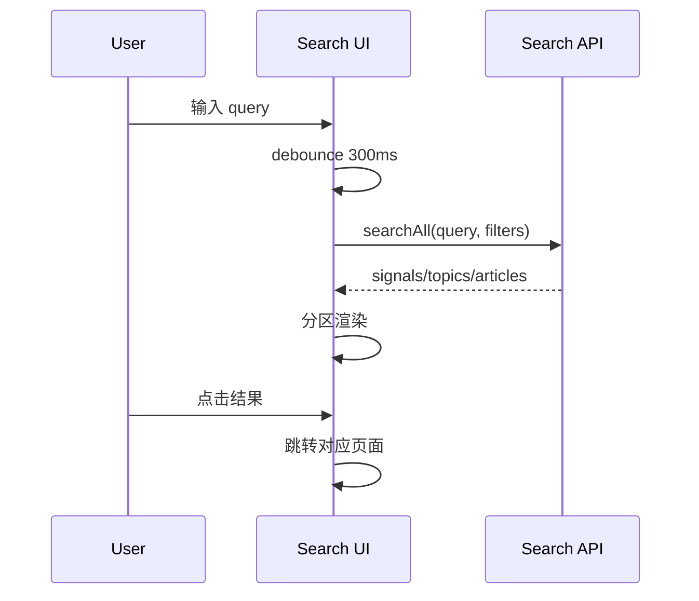

# Search 交互规格

> Search 先搜判断，再搜主题，最后搜文章。本文覆盖聚合搜索、筛选、最近搜索与跳转。

## 1. 信息架构



## 2. 搜索流程



## 3. 搜索状态

| 状态 | UI |
|------|----|
| 未输入 | 最近搜索 + 推荐搜索 |
| 输入中 | loading skeleton |
| 有结果 | Signals / Topics / Articles 分区 |
| 无结果 | 建议换关键词 / 清除筛选 |
| 失败 | 错误提示 + 重试 |

## 4. 结果类型

| 类型 | 字段 | 点击 |
|------|------|------|
| Signal | title, summary, why, time, source count | 跳 Today 并定位 Signal |
| Topic | name, definition, article count, tracked | 跳 Topic Detail |
| Article | title, snippet, feed, time, read/starred | 打开 Reader |

## 5. 筛选

筛选项：

- 全部
- 未读
- 已收藏
- 高信号
- 时间范围：今天 / 本周 / 本月 / 全部
- 类型：Signals / Topics / Articles
- 来源：全部 / 指定 Feed / Pack

规则：

- 筛选对所有分区生效。
- 某分区无结果时折叠。
- 清空 query 时保留筛选。

## 6. 最近搜索

记录：

```ts
interface RecentSearch {
  query: string;
  searchedAt: string;
  clickedResultType?: "signal" | "topic" | "article";
}
```

规则：

- 最多 10 条。
- 重复 query 更新时间。
- 支持单条删除和全部清空。

## 7. 键盘交互

- `/` 聚焦搜索框。
- `Enter` 打开第一条结果。
- `ArrowDown/ArrowUp` 在结果间移动。
- `Esc` 清空输入或退出搜索焦点。

## 8. 接口建议

| 功能 | 接口 |
|------|------|
| 聚合搜索 | `searchAll(query, filters)` |
| 最近搜索 | `getRecentSearches()` |
| 保存最近搜索 | `saveRecentSearch(query)` |
| 删除最近搜索 | `deleteRecentSearch(query)` |
| 清空最近搜索 | `clearRecentSearches()` |

## 9. 验收清单

- [ ] debounce 300ms。
- [ ] 三类结果分区。
- [ ] 点击结果跳转正确。
- [ ] 筛选项可组合。
- [ ] 最近搜索可删除/清空。
- [ ] 无结果和失败状态完整。
- [ ] 键盘操作可用。

