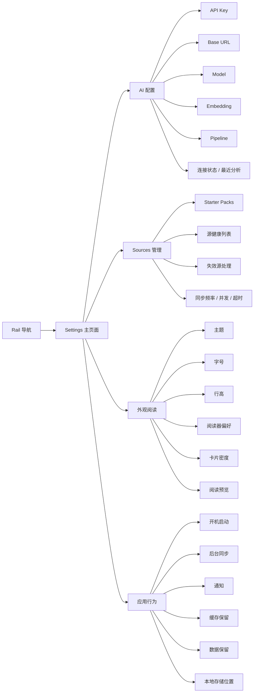
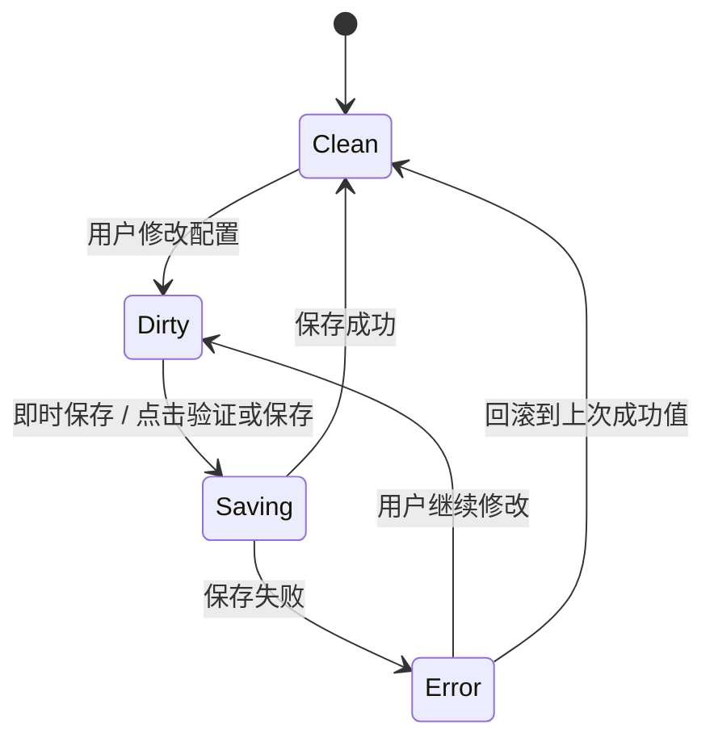
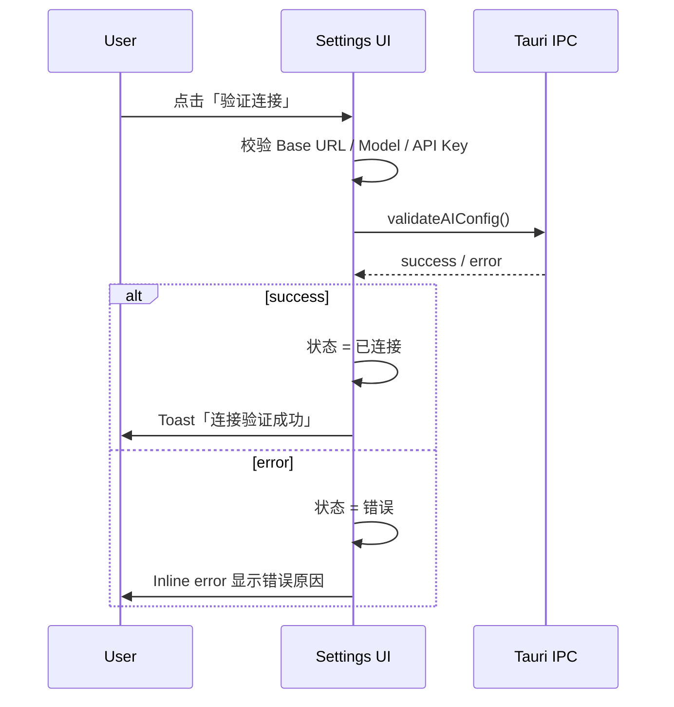
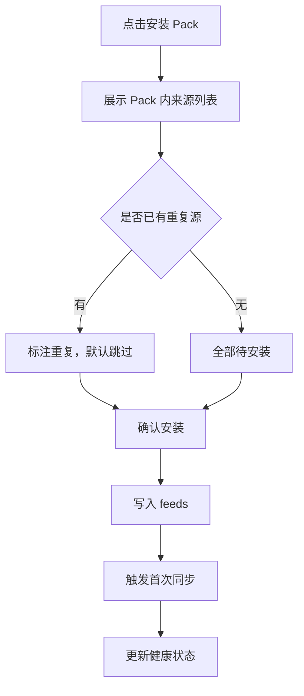
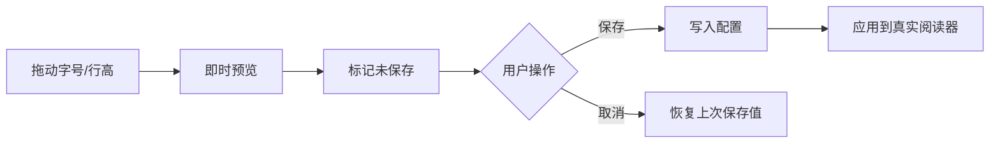
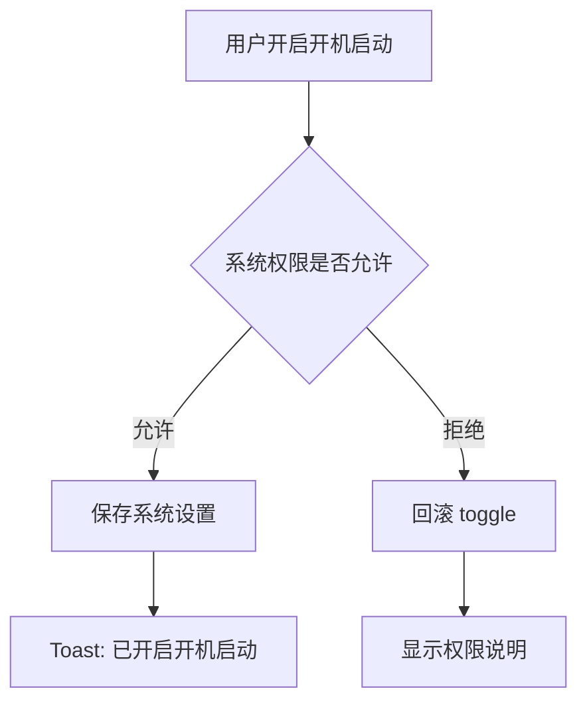

# Settings 功能交互说明

> 本文档用于开发新版 Settings 页面，目标是让实现者不依赖 mockup 也能完整落地所有设置项、状态、校验、保存和失败处理。

---

## 1. 设计结论

Settings 是信任层，不是杂项仓库。页面结构采用：

```text
Rail + Main
```

Settings 不使用中间 Sidebar。原因：

- Settings 内部已有 4 个一级分类 tab，再加 Sidebar 会形成重复导航。
- Settings 需要横向空间展示状态、解释、配置项和预览。
- Settings 的目标是让用户理解系统边界：数据在哪里、AI 做什么、同步如何运行。

---

## 2. 信息架构图



---

## 3. 页面通用规则

### 3.1 页面状态

Settings 顶部展示 3 个全局状态 pill：

| 状态 | 来源 | 示例 |
|------|------|------|
| 本地配置 | `getUserConfig` + AI 配置是否存在 | 本地配置安全 |
| 活跃来源 | Sources 数据 | 42 sources active |
| 最近分析 | Pipeline run / Today signals 状态 | 最近分析 2 小时前 |

若数据缺失：

- 本地配置：显示 `未配置`
- 活跃来源：显示 `暂无来源`
- 最近分析：显示 `尚未分析`

### 3.2 保存策略

以当前 mockup 为准，Settings 采用 `即时反馈 + 按操作保存`：

- Toggle、choice、slider、select 修改后立即反馈，并触发对应保存动作。
- 外观阅读修改后立即更新预览；保存失败时回滚到上一次成功值。
- API Key、Base URL、Model 等 AI 表单字段允许先编辑，再通过 `验证连接` / `保存 AI 配置` 提交。
- 清理缓存、缩短数据保留、删除/卸载等危险操作必须二次确认。
- 所有即时保存失败都必须回滚 UI，并显示错误 Toast。

### 3.3 脏状态规则



当用户切换 Settings tab：

- 大多数设置已经即时保存，可直接切换。
- 若 AI 表单中有未提交的新 Key/Base URL/Model，切换前提示：
  - `保存并切换`
  - `放弃更改`
  - `留在当前页`

### 3.4 通用反馈

| 场景 | 反馈 |
|------|------|
| 保存成功 | Toast：`设置已保存` 或对应动作成功 |
| 保存失败 | Inline error + Toast |
| 正在保存 | 保存按钮 loading，禁用重复提交 |
| 校验失败 | 字段下方显示错误，焦点回到字段 |
| 危险操作 | Modal 二次确认 |

---

## 4. AI 配置

### 4.1 字段

| 字段 | 控件 | 默认/占位 | 校验 | 保存接口 |
|------|------|-----------|------|----------|
| API Key | password input | `sk-••••` | 非空；长度 >= 20；保存后只显示掩码 | `saveAIConfig` |
| Base URL | text input | `https://api.openai.com/v1` | 必须是 http/https URL | `saveAIConfig` |
| Model | select/input combo | `gpt-4o-mini` | 非空 | `saveAIConfig` |
| Embedding Model | select/input combo | `text-embedding-3-small` | 开启 embedding 时必填 | `saveAIConfig` |
| Enable Embedding | toggle | 开 | boolean | `saveAIConfig` |
| Pipeline Interval | select | 每 6 小时 | 1/3/6/12/24 小时 | `saveAIConfig` |

已有前端接口：

```ts
getAIConfig()
saveAIConfig({
  apiKey,
  model,
  embeddingModel,
  baseUrl,
  pipelineIntervalHours,
  enableEmbedding,
})
validateAIConfig()
triggerPipeline(runType)
```

### 4.2 API Key 展示策略

- 首次未配置：显示空 password input。
- 已配置：显示掩码，如 `sk-••••••••••7F2a`。
- 用户点击 `更换`：
  - 清空输入框。
  - 显示提示：`输入新 Key 后保存才会替换当前配置`。
- 用户不输入新 Key 直接保存：
  - 不覆盖已有 Key。
- 用户输入新 Key 后保存失败：
  - 保留输入值，显示错误。

### 4.3 验证连接流程



注意：

- 验证连接不应自动保存未保存更改，除非用户明确点击 `保存并验证`。
- 若有未保存更改，验证按钮文案改为 `保存并验证`。

### 4.4 Pipeline 操作

| 操作 | 行为 |
|------|------|
| 开启 Pipeline | 保存 `pipelineIntervalHours`，显示下次运行时间 |
| 关闭 Pipeline | 保存为 disabled 状态；Today 不再自动分析 |
| 立即分析 | 调用 `triggerPipeline("manual")` |
| 分析中 | 禁用按钮，显示进度 pill |
| 分析失败 | 展示失败原因和重试按钮 |

### 4.5 AI 状态卡

必须展示：

- 当前连接状态：`未配置 / 已连接 / 错误 / 验证中`
- 最近分析时间
- 最近参与分析来源数
- 最近处理文章数
- 最近生成 Signals 数
- Embedding 是否开启

---

## 5. Sources 管理

### 5.1 页面职责

Sources 管理不替代 Feeds 页面。

| 页面 | 职责 |
|------|------|
| Feeds | 添加、删除、阅读、组织具体源 |
| Settings / Sources | 配置源的同步策略、Pack、健康状态和失效处理 |

### 5.2 Starter Packs

| 操作 | 交互 | 数据变化 |
|------|------|----------|
| 浏览 Pack | 打开 Pack 列表或 inline 展开 | 无 |
| 安装 Pack | Modal 确认安装数量 | 添加 feeds |
| 卸载 Pack | 二次确认 | 可选择是否删除源 |
| 查看 Pack 内容 | 展示源列表、领域、质量说明 | 无 |

Pack 卡片字段：

- 名称
- 描述
- 来源数量
- 已安装数量
- 健康状态
- 操作按钮：`安装 / 管理 / 卸载`

安装流程：



### 5.3 源健康列表

每行字段：

| 字段 | 说明 |
|------|------|
| Source | 源名称 + URL / 描述 |
| Health | 健康 / 注意 / 失效 |
| Last Sync | 最近同步时间 |
| Success Rate | 最近 N 次成功率 |
| Action | 设置 / 修复 / 停用 |

健康判断建议：

| 状态 | 条件 |
|------|------|
| 健康 | 最近 5 次成功 >= 4 次 |
| 注意 | 最近 5 次失败 2-3 次，或响应超时 |
| 失效 | 最近 5 次失败 >= 4 次，或 HTTP 404/410 |

### 5.4 失效源修复

点击 `修复` 后展示：

- 最近错误：HTTP 状态码 / timeout / parse error
- 最近成功时间
- 建议操作：
  - `重试同步`
  - `编辑 URL`
  - `停用源`
  - `删除源`

危险操作：

- 停用源：需要确认，但可恢复。
- 删除源：必须二次确认，并说明是否保留历史文章。

### 5.5 同步策略

| 设置项 | 控件 | 默认 | 校验/范围 | 接口建议 |
|--------|------|------|-----------|----------|
| 后台同步 | toggle | 开 | boolean | `updateInterval` 或 user config |
| 同步频率 | select | 30 分钟 | 0/15/30/60/180 分钟 | `updateInterval(intervalSeconds)` |
| 并发请求 | slider/stepper | 3 | 1-5 | `updateThreads(threads)` |
| 请求超时 | select | 15 秒 | 5/10/15/30 秒 | user config |

特殊规则：

- 同步频率为 `0` 表示禁用自动同步。
- 并发请求修改后对下一次同步生效，不中断当前同步。
- 请求超时过低时显示提醒：`可能导致慢源被误判失效`。

---

## 6. 外观阅读

### 6.1 字段

| 设置项 | 控件 | 默认 | 保存 |
|--------|------|------|------|
| 主题 | segmented/select | 跟随系统 | `updateTheme` / user config |
| 字号 | slider + number | 16px | user config |
| 行高 | slider + number | 1.6 | user config |
| 阅读器偏好 | choice card | 舒适 | user config |
| 卡片密度 | select/segmented | 舒适 | user config |

### 6.2 即时预览

外观配置需要即时影响右侧预览：

- 字号改变：预览正文字号变化
- 行高改变：预览段落行高变化
- 阅读器偏好：
  - 紧凑：减少上下间距
  - 舒适：默认
  - 沉浸：增加段落间距和最大宽度
- 卡片密度：
  - 紧凑：Signal 卡片摘要行数减少，间距更小
  - 舒适：默认

### 6.3 保存和取消



### 6.4 主题规则

当前 v2.x 以亮色为主。如果暗色尚未完整实现：

- `跟随系统` 可以存在，但暗色不可用时显示 `实验性`。
- 切换到暗色时若覆盖不完整，提示：`暗色模式仍在完善中`。

---

## 7. 应用行为

### 7.1 字段

| 设置项 | 控件 | 默认 | 说明 |
|--------|------|------|------|
| 开机启动 | toggle | 关 | 系统级设置，可能需要权限 |
| 后台同步 | toggle | 开 | 关闭窗口后仍同步 |
| 通知 | select + toggle | 关 | 可选仅高信号提醒 |
| 缓存保留 | select | 30 天 | 图片/解析/临时内容 |
| 数据保留 | select | 90 天 | 文章、分析元数据 |
| 退出行为 | info | 托盘隐藏 | 说明不可配置或另设选项 |

### 7.2 开机启动

流程：



开发注意：

- 若平台不支持，控件 disabled，并显示原因。
- macOS / Windows / Linux 可能需要不同后端实现。

### 7.3 后台同步

行为：

- 开启：关闭主窗口后保持托盘和调度器运行。
- 关闭：关闭窗口后不再后台同步，但应用是否退出由退出策略决定。

与同步频率的关系：

- Sources 中同步频率为 0 时，后台同步 toggle 应显示为关闭。
- 这里关闭后台同步，应同步影响 Sources 的自动同步状态。

### 7.4 通知

通知模式：

| 模式 | 行为 |
|------|------|
| 关闭 | 不发系统通知 |
| 高信号时通知 | 新增高置信 Signal 时通知 |
| 每日摘要 | 每天固定时间通知 |

通知点击：

- 点击高信号通知：打开 Today，并定位到对应 Signal。
- 点击每日摘要：打开 Today 顶部概览。

### 7.5 缓存清理

点击 `清理`：

1. 弹出确认 Modal。
2. 展示将清理的数据类型和预计大小。
3. 用户确认后执行清理。
4. 成功后更新缓存大小。

不可清理：

- SQLite 主数据库
- 用户配置
- 已收藏状态

### 7.6 数据保留

数据保留是高风险配置，必须说明影响：

- `90 天`：删除超过 90 天的已读文章正文和分析元数据，保留收藏。
- `永久保留`：不自动清理。
- `自定义`：后续可扩展。

切换为更短周期时：

- 必须二次确认。
- 展示预计受影响文章数量。
- 提供 `导出后再应用` 入口。

---

## 8. 数据模型建议

### 8.1 User Config

```ts
interface UserConfig {
  theme: "system" | "light" | "dark";
  update_interval: number; // seconds, 0 = disabled
  threads: number; // 1-5
  request_timeout_seconds?: number;
  reader_font_size?: number;
  reader_line_height?: number;
  reader_mode?: "compact" | "comfortable" | "immersive";
  card_density?: "compact" | "comfortable";
  launch_at_login?: boolean;
  background_sync?: boolean;
  notification_mode?: "off" | "high_signal" | "daily_digest";
  cache_retention_days?: number;
  data_retention_days?: number | "forever";
}
```

### 8.2 AI Config Public

```ts
interface AIConfigPublic {
  configured: boolean;
  apiKeyMasked?: string;
  baseUrl: string;
  model: string;
  embeddingModel: string;
  pipelineIntervalHours: number;
  enableEmbedding: boolean;
  lastValidatedAt?: string;
  lastValidationError?: string;
}
```

### 8.3 Source Health

```ts
interface SourceHealth {
  id: string;
  title: string;
  url: string;
  packId?: string;
  status: "healthy" | "warning" | "broken" | "disabled";
  lastSyncAt?: string;
  lastSuccessAt?: string;
  successRate: number;
  lastError?: {
    kind: "http" | "timeout" | "parse" | "unknown";
    message: string;
    statusCode?: number;
  };
}
```

---

## 9. 接口对照

已有：

| 功能 | 接口 |
|------|------|
| 获取用户配置 | `getUserConfig()` |
| 更新用户配置 | `updateUserConfig(cfg)` |
| 更新线程数 | `updateThreads(threads)` |
| 更新主题 | `updateTheme(theme)` |
| 更新同步间隔 | `updateInterval(interval)` |
| 获取 AI 配置 | `getAIConfig()` |
| 保存 AI 配置 | `saveAIConfig(config)` |
| 验证 AI 配置 | `validateAIConfig()` |
| 手动触发 Pipeline | `triggerPipeline(runType)` |

待补：

| 功能 | 建议接口 |
|------|----------|
| Starter Pack 列表 | `getStarterPacks()` |
| 安装 Pack | `installStarterPack(packId)` |
| 卸载 Pack | `uninstallStarterPack(packId, options)` |
| 源健康列表 | `getSourceHealth()` |
| 重试单个源 | `syncSource(sourceId)` |
| 停用源 | `disableSource(sourceId)` |
| 修复 URL | `updateSourceUrl(sourceId, url)` |
| 清理缓存 | `clearCache(options)` |
| 统计缓存大小 | `getCacheStats()` |
| 应用数据保留策略 | `applyRetentionPolicy(options)` |
| 导出数据 | `exportUserData(options)` |

---

## 10. 错误处理

| 错误 | 展示 | 恢复 |
|------|------|------|
| 网络/API Key 无效 | AI 配置字段下方 inline error | 修改后重试 |
| Base URL 不合法 | 字段错误 | 禁止保存 |
| 保存用户配置失败 | Toast + 保留 Dirty 状态 | 重试保存 |
| 同步源失败 | 源健康状态变为注意/失效 | 修复/重试 |
| 权限不足 | Modal 说明 | 引导系统设置 |
| 清理缓存失败 | Toast + 详情 | 重试 |
| 数据保留应用失败 | 不删除任何数据，显示错误 | 重试 |

---

## 11. 可访问性

- 所有 tab 使用 `button`，支持键盘 focus。
- tab 容器使用 `role="tablist"`，tab 使用 `role="tab"`，内容使用 `role="tabpanel"`。
- Toggle 使用真实 button + `aria-pressed`。
- Slider 使用 input range 或补充 `aria-valuenow`。
- Toast 使用 `role="status"`。
- Modal 打开后 focus trap，Esc 关闭。
- 错误文本使用 `aria-describedby` 关联字段。

---

## 12. 开发验收清单

### 12.1 页面结构

- [ ] Settings 页面不显示中间 Sidebar。
- [ ] 页面顶部显示标题、说明、全局状态 pill。
- [ ] 4 个 tab 均可键盘和鼠标切换。
- [ ] 切换 tab 时保留已加载数据，不重复请求无关接口。

### 12.2 AI 配置

- [ ] 未配置状态显示清楚。
- [ ] 已配置 API Key 只显示掩码。
- [ ] 更换 API Key 不会在空值保存时覆盖旧 Key。
- [ ] Base URL 非法时不能保存。
- [ ] 验证连接有 loading/success/error。
- [ ] Pipeline 可开启、关闭、立即运行。
- [ ] 保存失败后 UI 回到 Dirty 状态。

### 12.3 Sources 管理

- [ ] Pack 可查看、安装、卸载。
- [ ] 重复源安装时默认跳过。
- [ ] 源健康列表展示健康/注意/失效。
- [ ] 失效源可重试、编辑 URL、停用、删除。
- [ ] 同步频率支持 0 = 禁用自动同步。
- [ ] 并发请求限制在 1-5。
- [ ] 修改同步策略后有明确生效时机。

### 12.4 外观阅读

- [ ] 字号、行高可即时预览。
- [ ] 保存前切换 tab 会提示未保存更改。
- [ ] 取消后恢复上次保存值。
- [ ] 阅读器偏好和卡片密度实际影响对应页面。

### 12.5 应用行为

- [ ] 开机启动失败时回滚 toggle。
- [ ] 后台同步与 Sources 自动同步状态一致。
- [ ] 通知模式可保存。
- [ ] 缓存清理有二次确认。
- [ ] 数据保留变短有二次确认和影响说明。
- [ ] 本地存储路径说明准确。

### 12.6 回归

- [ ] Settings 打开不影响 Today/Feeds/Search 路由。
- [ ] 保存配置后重启应用仍生效。
- [ ] 旧用户缺少新增配置字段时使用默认值。
- [ ] 测试覆盖 user config slice、AI config panel、Settings tab dirty flow。

---

## 13. 推荐实现顺序

1. 页面骨架：Rail + Main + 4 tabs。
2. User config 读取、dirty/save/cancel 通用机制。
3. AI 配置完整落地。
4. 外观阅读即时预览。
5. Sources 健康和同步策略。
6. 应用行为和危险操作确认。
7. 可访问性和测试补齐。
