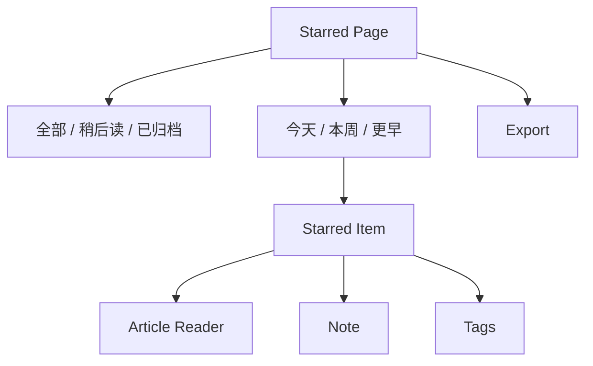
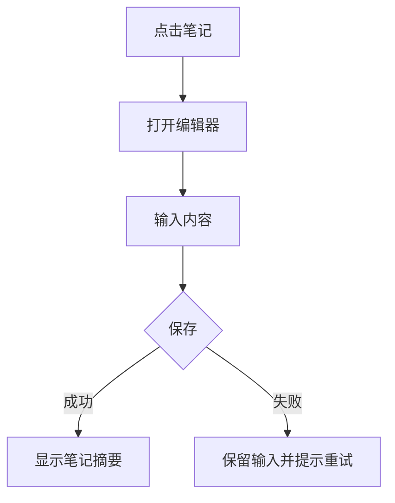
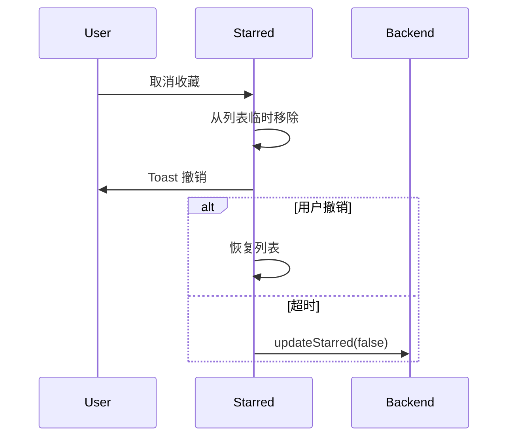

# Starred 交互规格

> Starred 是用户主动保存的长期价值内容，包含收藏、稍后读、笔记、标签、归档与导出。

## 1. 信息架构



## 2. 数据结构

```ts
interface StarredItem {
  articleId: string;
  title: string;
  feedTitle: string;
  url: string;
  starredAt: string;
  readLater: boolean;
  archived: boolean;
  note?: string;
  tags: string[];
  topicIds: string[];
  readProgress?: number;
}
```

## 3. 列表分组

默认：

- 今天收藏
- 本周回看
- 更早

筛选：

- 全部
- 稍后读
- 已归档
- 有笔记
- 高信号
- 标签

## 4. 操作

| 操作 | 行为 |
|------|------|
| 点击项 | 打开 Reader，source=starred |
| 取消收藏 | 从列表移除，显示撤销 toast |
| 稍后读 | 切换 readLater |
| 归档 | 移入 archived |
| 添加笔记 | 打开 inline editor 或 modal |
| 添加标签 | 打开 tag picker |
| 导出 | Markdown / JSON |

## 5. 笔记流程



## 6. 取消收藏撤销



## 7. 标签

规则：

- 标签可新增、删除、筛选。
- 删除标签只从当前文章移除，不删除全局标签。
- 标签输入支持逗号分隔。

## 8. 导出

导出格式：

- Markdown：标题、来源、链接、笔记、标签。
- JSON：完整 StarredItem。

导出范围：

- 当前筛选结果。
- 全部收藏。

## 9. 接口建议

| 功能 | 接口 |
|------|------|
| 列表 | `getStarredItems(filter)` |
| 收藏 | `updateStarred(articleId, starred)` |
| 稍后读 | `updateReadLater(articleId, readLater)` |
| 归档 | `archiveStarred(articleId, archived)` |
| 笔记 | `saveArticleNote(articleId, note)` |
| 标签 | `updateArticleTags(articleId, tags)` |
| 导出 | `exportStarred(filter, format)` |

## 10. 验收清单

- [ ] 列表分组和筛选正确。
- [ ] 点击项进入 Reader 并可返回。
- [ ] 取消收藏可撤销。
- [ ] Read Later 与 Starred 独立。
- [ ] 笔记可新增、编辑、删除。
- [ ] 标签可新增、移除、筛选。
- [ ] 导出当前筛选和全部收藏。

