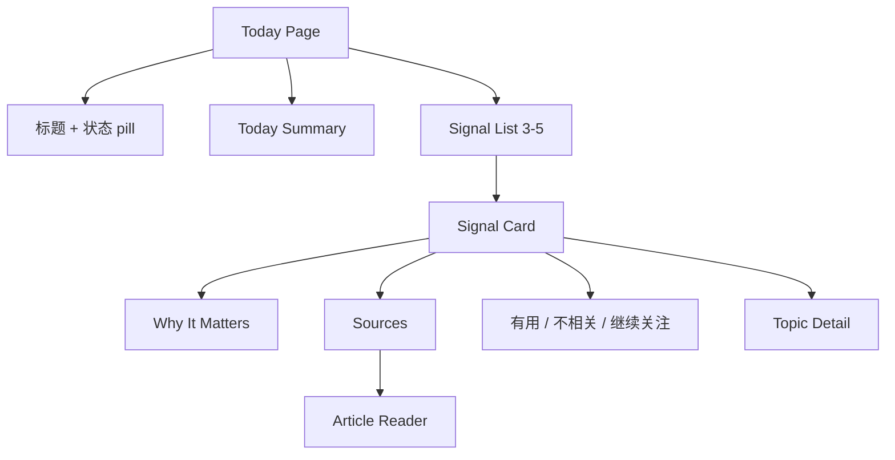
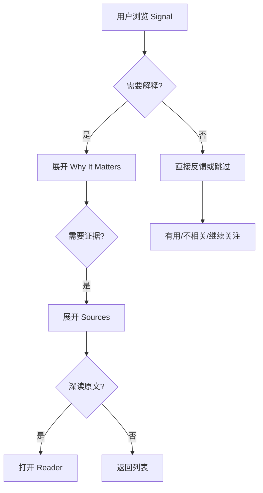
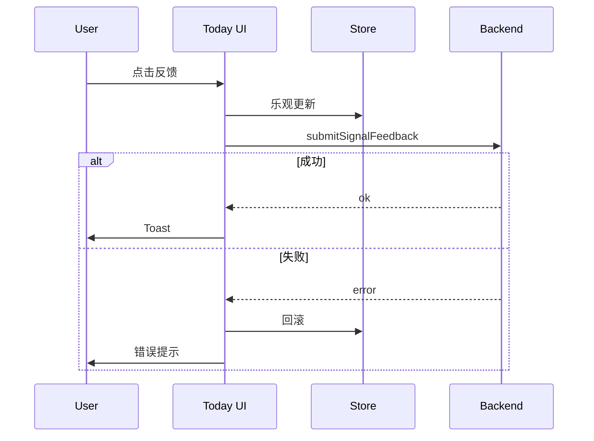

# Today 交互规格

> Today 给判断，不给文章流。本文描述 Today 从加载、展示、反馈到深读的完整交互。

## 1. 信息架构



## 2. 页面状态

| 状态 | UI |
|------|----|
| 首次使用无源 | Onboarding / Starter Pack CTA |
| 有源未同步 | 同步进度：`已同步 12/42 sources` |
| 同步完成未分析 | 分析中：`正在生成今日判断` |
| AI 未配置 | 配置 AI CTA，跳 Settings / AI |
| 有 Signals | Summary + SignalCard |
| 无高信号 | Quiet state + 查看 Topics/Feeds |
| 离线 | 显示缓存结果 + 离线 pill |

## 3. 数据结构

```ts
interface TodayOverview {
  summary: string;
  updatedAt?: string;
  sourceCount: number;
  processedArticleCount: number;
  signalCount: number;
  status: "idle" | "syncing" | "analyzing" | "ready" | "error";
}

interface SignalCardModel {
  id: string;
  title: string;
  summary: string;
  whyItMatters?: string;
  topic?: { id: string; name: string };
  confidence: number;
  articleCount: number;
  sourceCount: number;
  createdAt: string;
  sources: SignalSource[];
  feedback?: "useful" | "irrelevant" | "follow";
}
```

## 4. SignalCard 交互流程



点击规则：

| 点击 | 行为 |
|------|------|
| 卡片主体 | 展开/折叠 Why |
| Why 按钮 | 展开/折叠完整解释 |
| 来源数 | 展开来源列表 |
| 来源项 | 打开 Reader，ReaderContext.source = today |
| Topic tag | 打开 Topic Detail |
| 有用 | 保存 useful feedback |
| 不相关 | 保存 irrelevant，卡片弱化，可撤销 |
| 继续关注 | Follow Topic 或创建 Topic |

## 5. Feedback



## 6. 接口建议

| 功能 | 接口 |
|------|------|
| 获取概览 | `getTodayOverview()` |
| 获取 Signals | `getTodaySignals(limit)` |
| 获取来源 | `getSignalSources(signalId)` |
| 反馈 | `submitSignalFeedback(signalId, type)` |
| 继续关注 | `followTopic(topicId)` / `createTopicFromSignal(signalId)` |
| 手动分析 | `triggerPipeline("manual")` |

## 7. 错误处理

| 错误 | 处理 |
|------|------|
| AI 未配置 | 显示 CTA，跳 Settings |
| Pipeline 失败 | 错误 pill + 重试 |
| 来源加载失败 | 卡片内 inline error |
| 反馈失败 | 回滚按钮状态 |
| Reader 加载失败 | Reader 内错误态，保留返回 |

## 8. 验收清单

- [ ] Summary 不超过 2 句话。
- [ ] 默认展示 3-5 张 Signal。
- [ ] Why/Sources 可展开。
- [ ] 来源可进入 Reader 并返回 Signal。
- [ ] Feedback 可保存、失败回滚。
- [ ] AI 未配置和无数据状态完整。
- [ ] Pipeline 状态用户可读，不暴露技术阶段名。

