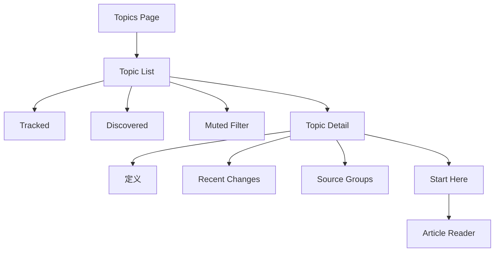
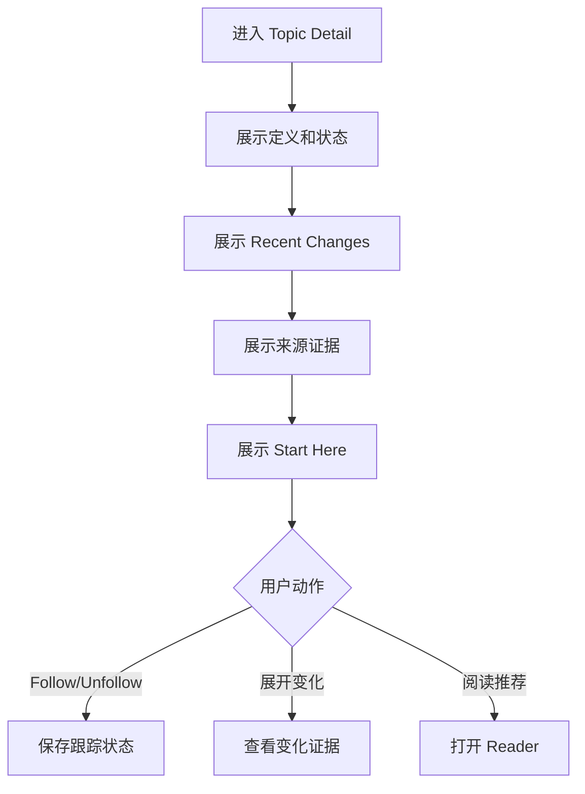

# Topics 交互规格

> Topics 给理解，不给堆叠。本文覆盖 Topic 列表、详情、跟踪、静音与深读入口。

## 1. 信息架构



## 2. Topic 列表

Topic 卡片字段：

| 字段 | 必须 | 说明 |
|------|------|------|
| name | 是 | Topic 名称 |
| definition | 是 | 一句话解释 |
| status | 是 | tracked / discovered / muted |
| newCount | 否 | 新变化数量 |
| articleCount | 是 | 覆盖文章数 |
| sourceCount | 是 | 来源数 |
| updatedAt | 是 | 最近更新时间 |
| confidence | 否 | 可信度 |

## 3. 列表交互

| 操作 | 行为 |
|------|------|
| 点击 Topic 卡片 | 进入 Topic Detail |
| Follow | 变为 tracked，出现在 Sidebar |
| Unfollow | 回到 discovered |
| Mute | 从默认列表隐藏 |
| 恢复 Muted | 从筛选中恢复 |
| 排序 | 最近更新 / 相关度 / 文章数 |

## 4. Topic Detail 流程



详情页必须按顺序展示：

1. Topic 是什么。
2. 最近发生了什么变化。
3. 哪些来源支持它。
4. 先读哪几篇。

## 5. 跟踪状态

| 状态 | UI | 影响 |
|------|----|------|
| tracked | 追踪中 badge | Sidebar 优先展示，Today 权重提高 |
| discovered | 发现 badge | 默认列表展示，可 Follow |
| muted | 静音 | 默认隐藏，Today 降权 |

状态保存失败时，必须回滚 UI。

## 6. 数据结构

```ts
interface Topic {
  id: string;
  name: string;
  definition: string;
  status: "tracked" | "discovered" | "muted";
  articleCount: number;
  sourceCount: number;
  signalCount: number;
  newCount: number;
  confidence?: number;
  updatedAt: string;
}

interface TopicDetail extends Topic {
  recentChanges: TopicChange[];
  sourceGroups: TopicSourceGroup[];
  startHere: RecommendedArticle[];
}
```

## 7. 接口建议

| 功能 | 接口 |
|------|------|
| 列表 | `getTopics({ status, sort })` |
| 详情 | `getTopicDetail(topicId)` |
| 跟踪 | `followTopic(topicId)` |
| 取消跟踪 | `unfollowTopic(topicId)` |
| 静音 | `muteTopic(topicId)` |
| 恢复 | `unmuteTopic(topicId)` |

## 8. 空状态

| 状态 | UI |
|------|----|
| 无 Topic | `Topics 将在 Today 产生信号后自动生成` |
| Tracked 为空 | 展示 Discovered + Follow 引导 |
| Discovered 为空 | 只展示 Tracked |
| Muted 为空 | 筛选页显示空说明 |

## 9. 验收清单

- [ ] Topic List 分区正确。
- [ ] Topic 卡片字段完整。
- [ ] Detail 顺序符合定义 → 变化 → 来源 → 推荐。
- [ ] Follow/Unfollow/Mute 可保存和回滚。
- [ ] 从 Today Topic tag 可进入详情。
- [ ] Start Here 可打开 Reader 并返回 Topic。

